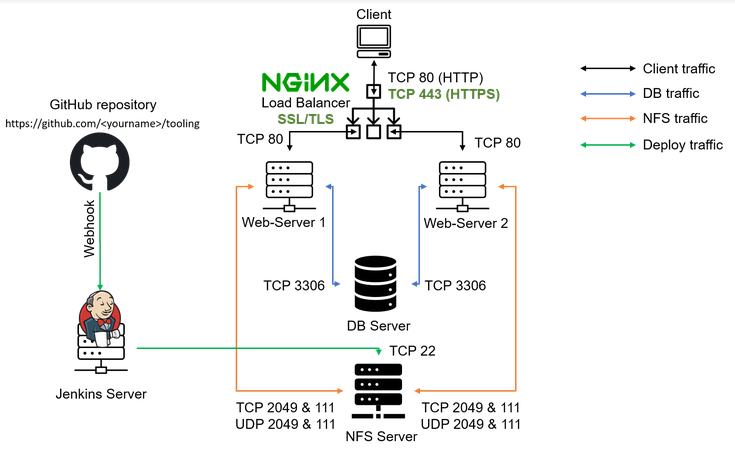
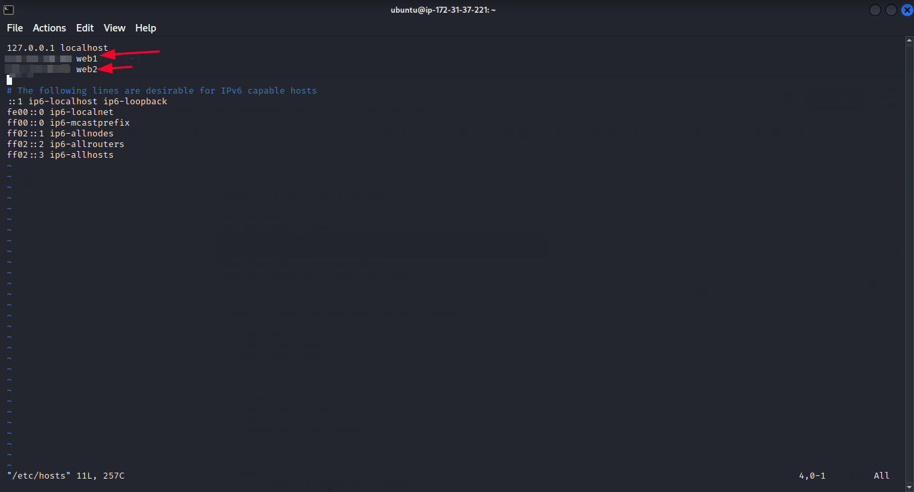
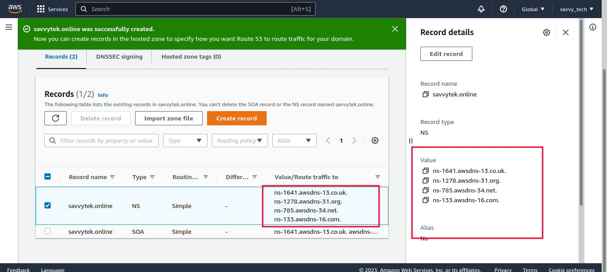
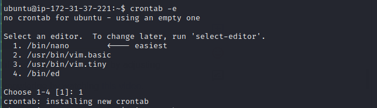

# LOAD-BALANCER-SOLUTION-WITH-NGINX-AND-SSL-TLS
In this project we will configure an Nginx Load Balancer solution and also ensure a secured connection using SSL/TLS. The Architecture will look like this:
 
  
 

------------
____________
### Task
This project consists of two parts:
1. Configure Nginx as a Load Balancer
2. Register a new domain name and configure secured connection using SSL/TLS certificates

-----------
__________
## CONFIGURE NGINX AS A LOAD BALANCER
* Create an EC2 VM based on Ubuntu Server 20.04 LTS and name it Nginx LB (do not forget to open TCP port 80 for HTTP connections, also open TCP port 443 – this port is used for secured HTTPS connections).

 
 

* Update /etc/hosts file for local DNS with Web Servers’ names (e.g. Web1 and Web2) and their local IP addresses.

   `sudo vi /etc/hosts`

   

* Install and configure Nginx as a load balancer to point traffic to the resolvable DNS names of the webservers.

      sudo apt update
      sudo apt install nginx

  

* Configure Nginx LB using Web Servers’ names defined in /etc/hosts.

Configure Nginx LB using Web Servers’ names defined in /etc/hosts. Open the default nginx configuration file
`sudo vi /etc/nginx/nginx.conf`

  )

* Restart Nginx and make sure the service is up and running.

      sudo systemctl restart nginx
      sudo systemctl status nginx
  

-----------
___________

## REGISTER A NEW DOMAIN NAME AND CONFIGURE SECURED CONNECTION USING SSL/TLS CERTIFICATES
Make necessary configurations to allow connections to our Tooling Web Solution secured!
In order to get a valid SSL certificate – you need to register a new domain name, you can do it using any Domain name registrar – a company that manages reservation of domain names. The most popular ones are: Godaddy.com, namecheap, WHogohost, Domain.com, Bluehost.com.

* Register a new domain name with any registrar of your choice in any domain zone (e.g. .com, .net, .org, .edu, .info, .online, .xyz or any other).

* Assign an Elastic IP to your Nginx LB server and associate your domain name with this Elastic IP. An Elastic IP is a static IP address that does not change when restart or stop/start your EC2 instance.

  

* Update [A record](https://www.cloudflare.com/learning/dns/dns-records/dns-a-record/) in your registrar to point to Nginx LB using Elastic IP address. Using Route 53, perform the following:

    * Create a hosted zone
    * Create records with paramters as shown below
   

    

    

    

    

* In your domain name portal, Update the DNS with values gotten from Route 53.

  

* Check that your Web Servers can be reached from your browser using new domain name using HTTP protocol – `http://<your-domain-name.com>`

  

* Configure Nginx to recognize your new domain name. Update your nginx.conf with server_name www.<your-domain-name.com> instead of server_name www.domain.com.

  

* Install [certbot](https://certbot.eff.org/) and request for an SSL/TLS certificate. Before installing certbot, make sure snapd service is active and running.
  `sudo systemctl status snapd`
  * Install certbot

     `sudo snap install --classic certbot`

     

* Request your certificate (just follow the certbot instructions – you will need to choose which domain you want your certificate to be issued for, domain name will be looked up from nginx.conf file.

      sudo ln -s /snap/bin/certbot /usr/bin/certbot
      sudo certbot --nginx

* Test secured access to your Web Solution by trying to reach https://<your-domain-name.com>
You shall be able to access your website by using HTTPS protocol (that uses TCP port 443).

  

* You can click on the padlock icon to see the details of the certificate issued for your website.

* Set up periodical renewal of your SSL/TLS certificate. By default, LetsEncrypt certificate is valid for 90 days, so it is recommended to renew it at least every 60 days or more frequently.
You can test renewal command in dry-run mode.
`sudo certbot renew --dry-run`
Best pracice is to have a scheduled job that wil run renew command periodically. Let us configure a cronjob to run the command twice a day.
To do so, we edit the crontab file with the following command:

    `crontab -e`

  Add following line:

  `* */12 * * *   root /usr/bin/certbot renew > /dev/null 2>&1`

  
  

* This schdeules the cronjob to run every 12 hours, that is twice everyday.

* You can always change the interval of this cronjob if twice a day is too often by adjusting schedule expression.

* You can log into your website using the username and password set in previious projects.

  

----------
### Congratulations!!! 
You have just implemented an Nginx Load Balancing Web Solution with secured HTTPS connection with periodically updated SSL/TLS certificates.

