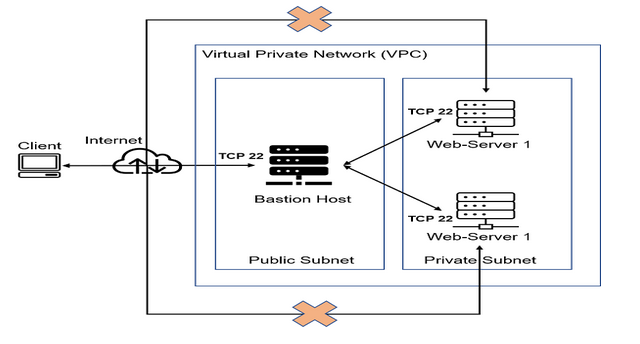
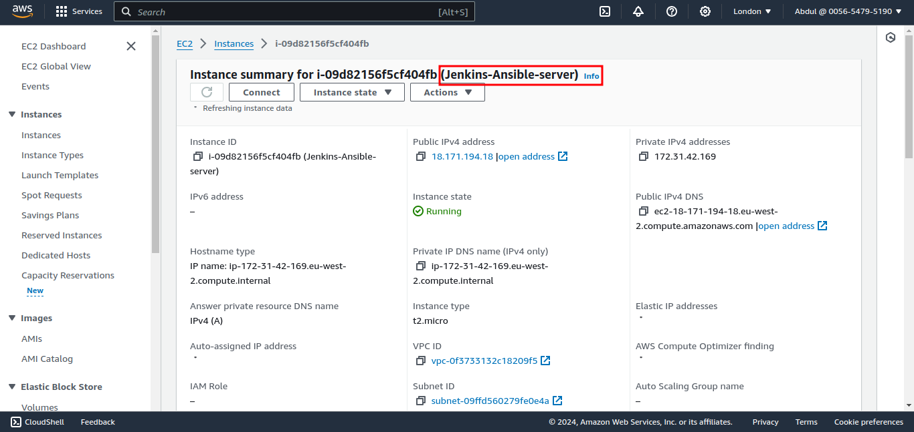
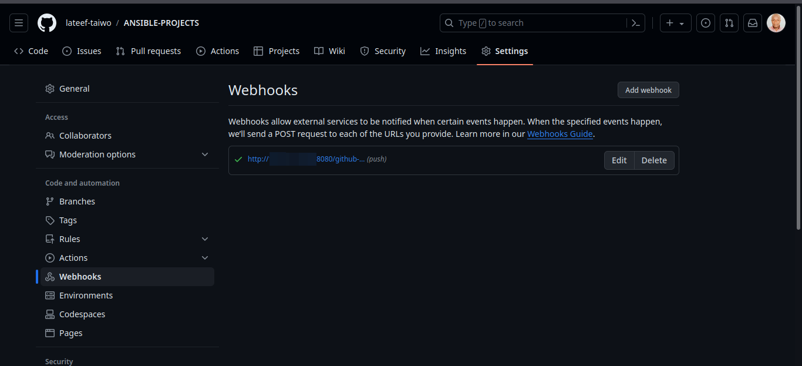
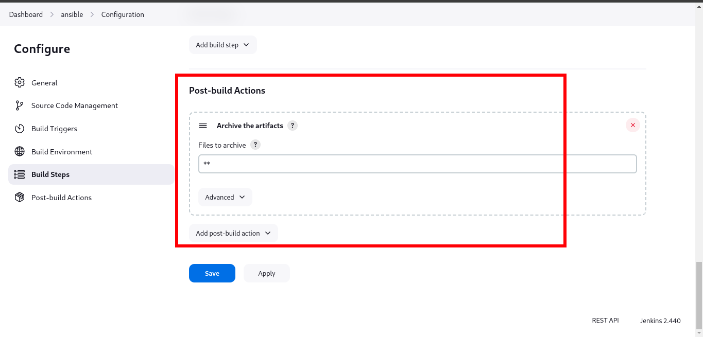
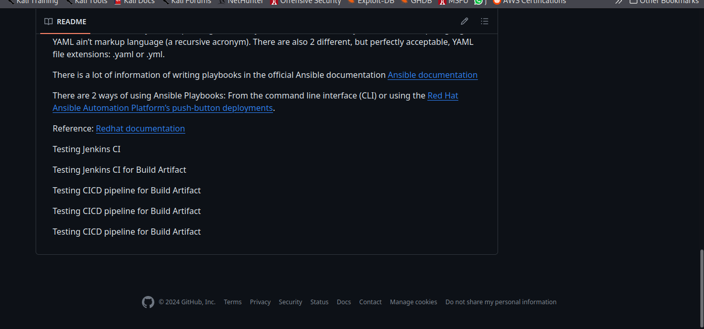
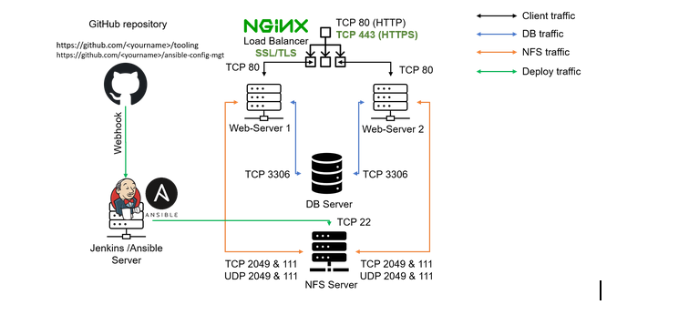
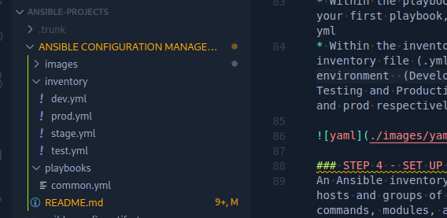
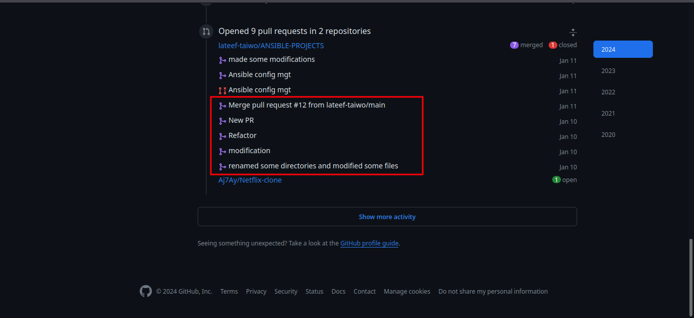
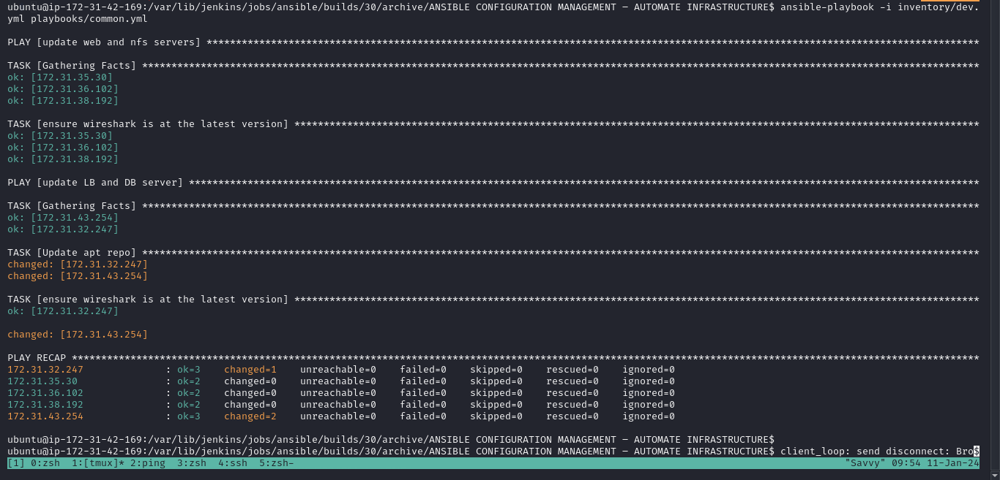
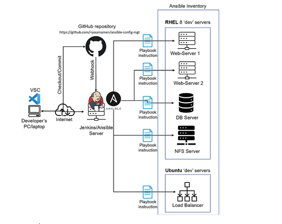

## Configuration Management
According to [Red Hat](https://www.redhat.com/en/topics/automation/what-is-configuration-management#:~:text=Configuration%20management%20is%20a%20process,in%20a%20desired%2C%20consistent%20state.&text=Managing%20IT%20system%20configurations%20involves,building%20and%20maintaining%20those%20systems.), Configuration management is a process for maintaining computer systems, servers, and software in a desired, consistent state. It’s a way to make sure that a system performs as it’s expected to as changes are made over time. 

Managing IT system configurations involves defining a system's desired state—like server configuration—then building and maintaining those systems. Closely related to configuration assessments and drift analyses, configuration management uses both to identify systems to update, reconfigure, or patch.

## Ansible Client as a Jump Server (Bastion Host)
A Jump Server (sometimes also referred as Bastion Host) is an intermediary server through which access to internal network can be provided. If you think about the current architecture you are working on, ideally, the webservers would be inside a secured network which cannot be reached directly from the Internet. That means, even DevOps engineers cannot SSH into the Web servers directly and can only access it through a Jump Server – it provide better security and reduces attack surface.
On the diagram below the Virtual Private Network (VPC) is divided into two subnets – Public subnet has public IP addresses and Private subnet is only reachable by private IP addresses.

### STEP 1 - INSTALL AND CONFIGURE ANSIBLE ON EC2 INSTANCE
* Update Name tag on your Jenkins EC2 Instance to "Jenkins-Ansible server". We will use this server to run playbooks.

* In your GitHub account create a new repository and name it ansible-config-mgt.
* Install Ansible on Jenkins-Ansible EC2 instance

        sudo apt update

        sudo apt install ansible

* After installation, Check your Ansible version by running `ansible --version`

    

* Log into your jenkins-ansible GUI and Configure Jenkins build job to save your repository content every time you change it.

* Create a new Freestyle project ansible in Jenkins and point it to your ‘ansible-config-mgt’ repository.

* Copy GitHub repo link

* Paste in Repository field under Ansible source code management congiguration.

* Configure Webhook in GitHub and set webhook to trigger ansible build.

* Configure a Post-build job to save all (**) files.

    

* Test your setup by making some change in README.MD file in master branch

* Ensure that builds starts automatically and Jenkins saves the files (build artifacts) in following folder.
`ls /var/lib/jenkins/jobs/Ansible/builds/<build_number>/archive/`

Note: Trigger Jenkins project execution only for /main (master) branch.
* Now your setup will look like this:

  

*  Every time you stop/start your Jenkins-Ansible server – you have to reconfigure GitHub webhook to a new IP address, in order to avoid it, it makes sense to allocate an Elastic IP to your Jenkins-Ansible server. Note that Elastic IP is free only when it is being allocated to an EC2 Instance, so do not forget to release Elastic IP once you terminate your EC2 Instance.

### Step 2 – Prepare your development environment using Visual Studio Code
First part of ‘DevOps’ is ‘Dev’, which means you will require to write some codes and you shall have proper tools that will make your coding and debugging comfortable – you need an Integrated development environment (IDE) or Source-code Editor. There is a plethora of different IDEs and Source-code Editors for different languages with their own advantages and drawbacks, you can choose whichever you are comfortable with, but we recommend one free and universal editor that will fully satisfy your needs – Visual Studio Code (VSC).

* Clone down your ansible-config-mgt repo to your Jenkins-Ansible instance
    
      git clone <ansible-config-mgt repo link>

### STEP 3 -BEGIN ANSIBLE DEVELOPMENT
* In your ansible-config-mgt GitHub repository, create a new branch that will be used for development of a new feature.
Tip: Give your branches descriptive and comprehensive names, for example, if you use [Jira](https://www.atlassian.com/software/jira) or [Trello](https://trello.com/) as a project management tool – include ticket number (e.g. PRJ-145) in the name of your branch and add a topic and a brief description what this branch is about – a bugfix, hotfix, feature, release (e.g. feature/prj-145-lvm).
Note: While Trello and Jira both offer top-notch task management tools, they each have different strengths. The biggest difference between the two is that Trello offers just Kanban boards while Jira offers Kanban, Scrum and sprint boards. Scrum and Kanban boards are both used to visually track a project's tasks. They are both Agile frameworks.

* Checkout the newly created feature branch to your local machine and start building your code and directory structure
* Create a directory and name it playbooks – it will be used to store all your playbook files.
* Create a directory and name it inventory – it will be used to keep your hosts organised.
* Within the playbooks folder, create your first playbook, and name it common.yml
* Within the inventory folder, create an inventory file (.yml) for each environment  (Development, Staging Testing and Production) dev, stage, test, and prod respectively.

### STEP 4 - SET UP AN ANSIBLE INVENTORY
An Ansible inventory file defines the hosts and groups of hosts upon which commands, modules, and tasks in a playbook operate. Since our intention is to execute Linux commands on remote hosts, and ensure that it is the intended configuration on a particular server that occurs. It is important to have a way to organize our hosts in such an Inventory.
Save below inventory structure in the inventory/dev file to start configuring your development servers. Ensure to replace the IP addresses according to your own setup.
Note: Ansible uses TCP port 22 by default, which means it needs to ssh into target servers from Jenkins-Ansible host – for this you can implement the concept of [ssh-agent](https://smallstep.com/blog/ssh-agent-explained/#:~:text=ssh%2Dagent%20is%20a%20key,you%20connect%20to%20a%20server.&text=It%20doesn't%20allow%20your%20private%20keys%20to%20be%20exported.). Now you need to import your key into ssh-agent:

    eval `ssh-agent -s`

    ssh-add <path-to-private-key>

* Confirm the key has been added with the command below, you should see the name of your key

      ssh-add -l
    
Now, ssh into your Jenkins-Ansible server using ssh-agent.

         ssh -A ubuntu@public-ip
 
    

You can also ssh into the other servers from the jenkins server using:

     ssh -A username@public-ip

* Also notice, that your Load Balancer user is ubuntu and user for RHEL-based servers is ec2-user.

* Update your inventory/dev.yml file with this snippet of code:

        [nfs]
        <NFS-Server-Private-IP-Address> ansible_ssh_user='ec2-user'

        [webservers]
        <Web-Server1-Private-IP-Address> ansible_ssh_user='ec2-user'
        <Web-Server2-Private-IP-Address> ansible_ssh_user='ec2-user'

        [db]
        <Database-Private-IP-Address> ansible_ssh_user='ec2-user'

        [lb]
        <Load-Balancer-Private-IP-Address> ansible_ssh_user='ubuntu'

### Step 5 - CREATE A COMMON PLAYBOOK
It is time to start giving Ansible the instructions on what you needs to be performed on all servers listed in inventory/dev.
In common.yml playbook you will write configuration for repeatable, re-usable, and multi-machine tasks that is common to systems within the infrastructure.

Update your playbooks/common.yml file with following code:
 

    ---
    - name: update web and nfs servers
    hosts: webservers, nfs
    remote_user: ec2-user
    become: yes
    become_user: root
    tasks:
        - name: ensure wireshark is at the latest version
        yum:
            name: wireshark
            state: latest

    - name: update LB and DB server
    hosts: lb, db
    remote_user: ubuntu
    become: yes
    become_user: root
    tasks:
        - name: Update apt repo
        apt: 
            update_cache: yes

        - name: ensure wireshark is at the latest version
        apt:
            name: wireshark
            state: latest
 
 Examine the code above and try to make sense out of it. This playbook is divided into two parts, each of them is intended to perform the same task: install wireshark utility (or make sure it is updated to the latest version) on your RHEL 8 and Ubuntu servers. It uses root user to perform this task and respective package manager: yum for RHEL 8 and apt for Ubuntu.

Feel free to update this playbook with following tasks:

    Create a directory and a file inside it
    Change timezone on all servers
    Run some shell script etc

For a better understanding of Ansible playbooks – [watch this video](https://youtu.be/ZAdJ7CdN7DY) from [RedHat](https://youtu.be/ZAdJ7CdN7DY) and read this [article](https://www.redhat.com/en/topics/automation/what-is-an-ansible-playbook).

### Step 6 – Update GIT with the latest code

Now all of your directories and files live on your machine and you need to push changes made locally to GitHub. It is important to learn how to collaborate with help of GIT. In many organisations there is a development rule that do not allow to deploy any code before it has been reviewed by an extra pair of eyes – it is also called "Four eyes principle". Now you have a separate branch, you will need to know how to raise a Pull Request (PR), get your branch peer reviewed and merged to the master branch.

Commit your code into GitHub: 16. use git commands to add, commit and push your branch to GitHub.

`git status`

`git add <selected files>`

`git commit -m "commit message"`

* 
    Create a Pull request (PR)
    
* Head back on your terminal, checkout from the feature branch into the master, and pull down the latest changes.

Once your code changes appear in master branch – Jenkins will do its job and save all the files (build artifacts) to `/var/lib/jenkins/jobs/ansible/builds/<build_number>/archive/` directory on Jenkins-Ansible server.

## RUN FIRST ANSIBLE TEST

### Step 7 – Run first Ansible test

Now, it is time to execute ansible-playbook command and verify if your playbook actually works:

`cd /var/lib/jenkins/jobs/ansible/builds/4/archive`

`ansible-playbook -i inventory/dev.yml playbooks/common.yml`

You can go to each of the servers and check if wireshark has been installed by running;

  `which wireshark`
  
  or 

  `wireshark --version`

Your updated with Ansible architecture now looks like this:

## Congratulations!! You have just automated your routine tasks by implementing your first Ansible project!