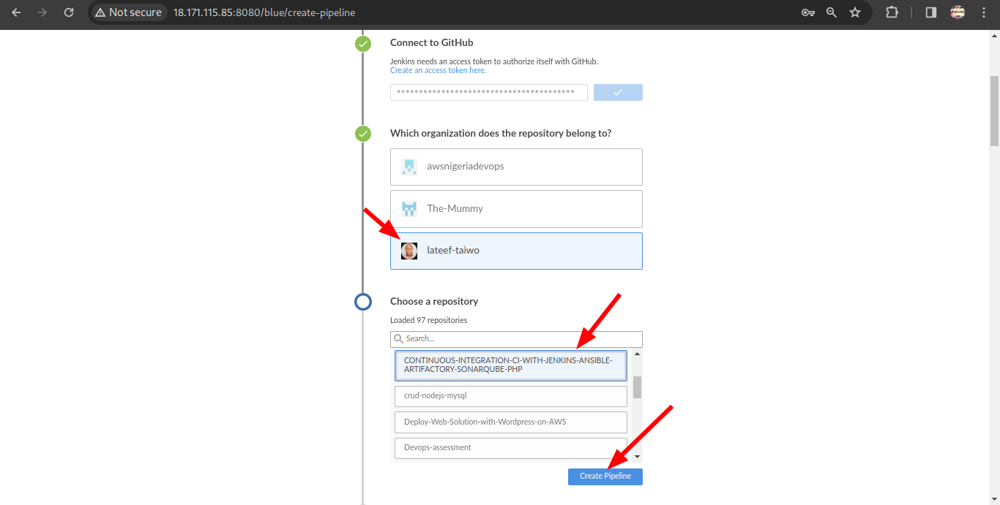
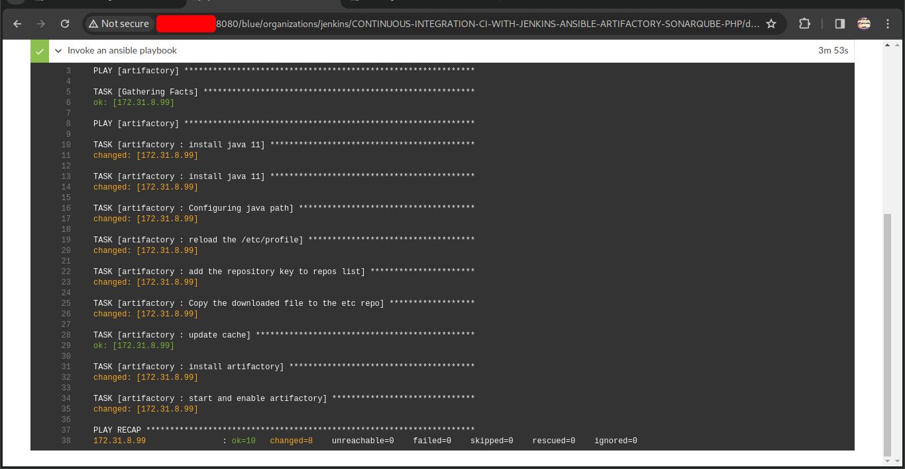
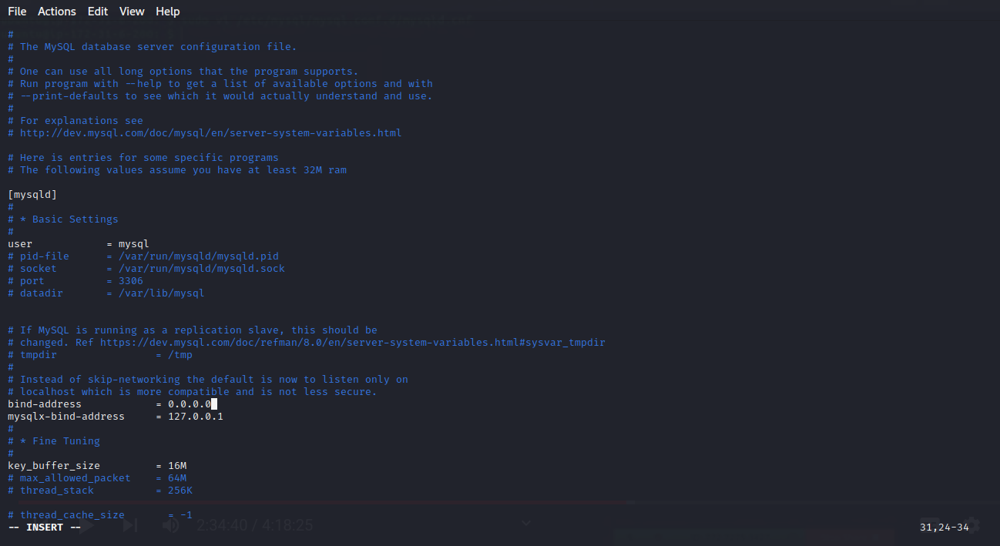
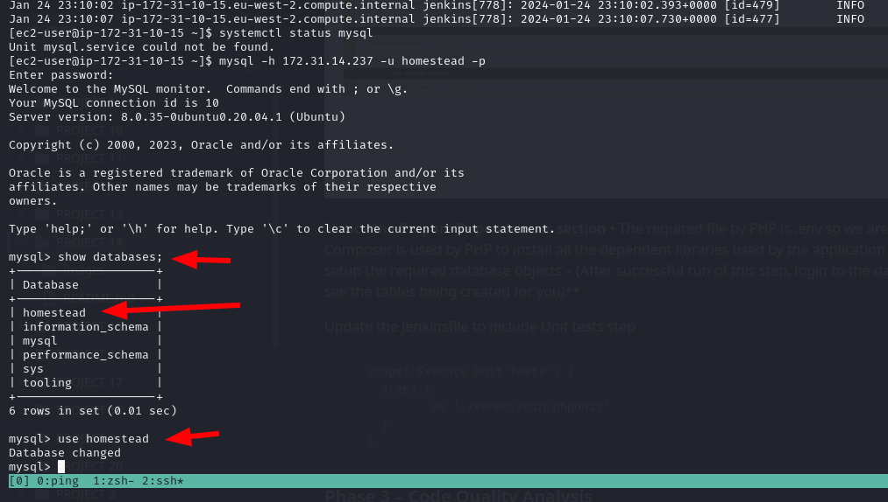

## CONTINUOUS-INTEGRATION-CI-WITH-JENKINS-ANSIBLE-ARTIFACTORY-SONARQUBE-PHP
-------------
### Experience CONTINUOUS INTEGRATION (CI) WITH JENKINS | ANSIBLE | ARTIFACTORY | SONARQUBE | PHP
--------------

### What is Continuous Integration?
------

In software engineering, Continuous Integration (CI) is a practice of merging all developers’ working copies to a shared mainline (e.g., Git Repository or some other version control system) several times per day. Frequent merges reduce chances of any conflicts in code and allow to run tests more often to avoid massive rework if something goes wrong. This principle can be formulated as Commit early, push often.
The general idea behind multiple commits is to avoid what is generally considered as Merge Hell or Integration hell. When a new developer joins a new project, he or she must create a copy of the main codebase by starting a new feature branch from the mainline to develop his own features (in some organization or team, this could be called a develop, main or master branch). If there are tens of developers working on the same project, they will all have their own branches created from mainline at different points in time. Once they make a copy of the repository it starts drifting away from the mainline with every new merge of other developers’ codes. If this lingers on for a very long time without reconciling the code, then this will cause a lot of code conflict or Merge Hell, as rightly said. Imagine such a hell from tens of developers or worse, hundreds. So, the best thing to do, is to continuously commit & push your code to the mainline. As many times as tens times per day. With this practice, you can avoid Merge Hell or Integration hell.
CI concept is not only about committing your code. There is a general workflow, let us start it…
Run tests locally: Before developers commit their code to a central repository, it is recommended to test the code locally. So, [Test-Driven Development (TDD)](https://en.wikipedia.org/wiki/Test-driven_development) approach is commonly used in combination with CI. Developers write tests for their code called unit-tests, and before they commit their work, they run their tests locally. This practice helps a team to avoid having one developer’s work-in-progress code from breaking other developers’ copy of the codebase.
Compile code in CI: After testing codes locally, developers commit and push their work to a central repository. Rather than building the code into an executable locally, a dedicated CI server picks up the code and runs the build there. In this project we will use, already familiar to you, Jenkins as our CI server. Build happens either periodically – by polling the repository at some configured schedule, or after every commit. Having a CI server where builds run is a good practice for a team, as everyone has visibility into each commit and its corresponding builds.
Run further tests in CI: Even though tests have been run locally by developers, it is important to run the unit-tests on the CI server as well. But, rather than focusing solely on unit-tests, there are other kinds of tests and code analysis that can be run using CI server. These are extremely critical to determining the overall quality of code being developed, how it interacts with other developers’ work, and how vulnerable it is to attacks. A CI server can use different tools for Static Code Analysis, Code Coverage Analysis, Code smells Analysis, and Compliance Analysis. In addition, it can run other types of tests such as Integration and Penetration tests. Other tasks performed by a CI server include production of code documentation from the source code and facilitate manual quality assurance (QA) testing processes.
Deploy an artifact from CI: At this stage, the difference between CI and CD is spelt out. As you now know, CI is Continuous Integration, which is everything we have been discussing so far. CD on the other hand is Continuous Delivery which ensures that software checked into the mainline is always ready to be deployed to users. The deployment here is manually triggered after certain QA tasks are passed successfully. There is another CD known as Continuous Deployment which is also about deploying the software to the users, but rather than manual, it makes the entire process fully automated. Thus, Continuous Deployment is just one step ahead in automation than Continuous Delivery.

### Continuous Integration in The Real World
To emphasize a typical CI Pipeline further, let us explore the diagram below a little deeper.

### SIMULATING A TYPICAL CI/CD PIPELINE FOR A PHP BASED APPLICATION
As part of the ongoing infrastructure development with Ansible started from Project 11, you will be tasked to create a pipeline that simulates continuous integration and delivery. Target end to end CI/CD pipeline is represented by the diagram below. It is important to know that both Tooling and TODO Web Applications are based on an interpreted (scripting) language (PHP). It means, it can be deployed directly onto a server and will work without compiling the code to a machine language.
The problem with that approach is, it would be difficult to package and version the software for different releases. And so, in this project, we will be using a different approach for releases, rather than downloading directly from git, we will be using [Ansible uri module](https://docs.ansible.com/ansible/latest/collections/ansible/builtin/uri_module.html).

### Set Up
This project is partly a continuation of your Ansible work, so simply add and subtract based on the new setup in this project. It will require a lot of servers to simulate all the different environments from dev/ci all the way to production. This will be quite a lot of servers altogether (But you don’t have to create them all at once. Only create servers required for an environment you are working with at the moment. For example, when doing deployments for development, do not create servers for integration, pentest, or production yet).

To get started, we will focus on these environments initially.
* Ci
* Dev
* Pentest
Both System Integration Testing (SIT) and UAT – User Acceptance Testing do not require a lot of extra installation or configuration. They are basically the webservers holding our applications. But Penetration testing is where we will conduct security related tests, so some other tools and specific configurations will be needed. In some cases, it will also be used for Performance and Load testing. Otherwise, that can also be a separate environment on its own. It all depends on decisions made by the company and the team running the show.
What we want to achieve, is having Nginx to serve as a reverse proxy for our sites and tools. Each environment setup is represented in the below table and diagrams.

### Table
---------

   CI  |  DEV  |  SIT  |  UAT  |  PENTEST  | PRE-PROD | PROD |
|------|-------|-------|--------|----------|----------|---------|
|Nginx| Nginx|Nginx|Nginx|Nginx| Nginx| Nginx |
|Sonarqube|Tooling|Tooling |Tooling|Tooling|Tooling|Tooling|
|Artifactory |TODO  WebApp|TODO  WebApp|TODO  WebApp|TODO  WebApp|TODO  WebApp|TODO  WebApp
   |Jenkins|  __   |  __  |  __  |  __  |  __  |    __|

### CI-Environment

#### Ansible Inventory should look like this

    ├── ci
    ├── dev
    ├── pentest
    ├── pre-prod
    ├── prod
    ├── sit
    └── uat

#### ci inventory file
    [jenkins]
    <Jenkins-Private-IP-Address>

    [nginx]
    <Nginx-Private-IP-Address>

    [sonarqube]
    <SonarQube-Private-IP-Address>

    [artifact_repository]
    <Artifact_repository-Private-IP-Address>

#### dev Inventory file
    [tooling]
    <Tooling-Web-Server-Private-IP-Address>

    [todo]
    <Todo-Web-Server-Private-IP-Address>

    [nginx]
    <Nginx-Private-IP-Address>

    [db:vars]
    ansible_user=ec2-user
    ansible_python_interpreter=/usr/bin/python

    [db]
    <DB-Server-Private-IP-Address>

#### pentest inventory file
    [pentest:children]
    pentest-todo
    pentest-tooling

    [pentest-todo]
    <Pentest-for-Todo-Private-IP-Address>

    [pentest-tooling]
    <Pentest-for-Tooling-Private-IP-Address>

ANSIBLE ROLES FOR CI ENVIRONMENT

Now go ahead and Add two more roles to ansible:

    SonarQube (Scroll down to the Sonarqube section to see instructions on how to set up and configure SonarQube manually)
    Artifactory

### Configuring the Jenkins Server

    Install jenkins with its dependencies using the official documentation from Jenkins here

### Update the bash profile

    sudo -i

    vi .bash_profile

 

    export JAVA_HOME=$(dirname $(dirname $(readlink $(readlink $(which java)))))
    export PATH=$PATH:$JAVA_HOME/bin 
    export CLASSPATH=.:$JAVA_HOME/jre/lib:$JAVA_HOME/lib:$JAVA_HOME/lib/tools.jar

Reload the bash profile

    source ~/.bash_profile

NB: This is done so that the path is exported anytime the machine is restarted

Install jenkins from the official [documentation](https://www.jenkins.io/doc/book/installing/linux/#red-hat-centos)

Start the jenkins server

    sudo systemctl start jenkins
    sudo systemctl enable jenkins
    sudo systemctl status jenkins

 

Install git and clone down your [ansible-congig-mgt](https://github.com/lateef-taiwo/ANSIBLE-PROJECTS.git) repository

### Configuring Ansible For Jenkins Deployment
In previous projects, you have been launching Ansible commands manually from a CLI. Now, with Jenkins, we will start running Ansible from Jenkins UI. To do this,

1. Navigate to Jenkins URL
2. Install & Open Blue Ocean Jenkins Plugin

3. Create a new pipeline

4. Select GitHub

5. Login to GitHub & Generate an Access Token

6. Copy Access Token

7. Paste the token and connect

8. Create a new pipelne

* At this point you may not have a Jenkinsfile in the Ansible repository, so Blue Ocean will attempt to give you some guidance to create one. But we do not need that. We will rather create one ourselves. So, click on Administration to exit the Blue Ocean console.

#### Create our Jenkinsfile

* Inside the Ansible project, create a new directory deploy and start a new file J  `Jenkinsfile `  inside the directory. For me, I created a new repository for this project and copied the contents of the ansible-config-artifact repository to it.

* Add the code snippet below to start building the  Jenkinsfile  gradually. This pipeline currently has just one stage called `Build` and the only thing we are doing is using the shell script module to echo Building Stage

      pipeline {
          agent any

      stages {
          stage('Build') {
          steps {
              script {
              sh 'echo "Building Stage"'
              }
          }
          }
          }
      }

* Now go back into the Ansible pipeline in Jenkins, and select configure

* Scroll down to Build Configuration section and specify the location of the Jenkinsfile at deploy/Jenkinsfile

* Back to the pipeline again, this time click "Build now"

* This will trigger a build and you will be able to see the effect of our basic Jenkinsfile configuration by going through the console output of the build.

To really appreciate and feel the difference of Cloud Blue UI, it is recommended to try triggering the build again from Blue Ocean interface.

1. Click on `Open Blue Ocean`

2 Select your project
3. Click on the play button against the branch

* Notice that this pipeline is a multibranch one. This means, if there were more than one branch in GitHub, Jenkins would have scanned the repository to discover them all and we would have been able to trigger a build for each branch.
Let us see this in action.
1. Create a new git branch and name it `feature/jenkinspipeline

2. Currently we only have the Build stage. Let us add another stage called Test. Paste the code snippet below and push the new changes to GitHub.

2. Currently we only have the Build stage. Let us add another stage called Test. Paste the code snippet below and push the new changes to GitHub.

        pipeline {
        agent any

            stages {
              stage('Build') {
                steps {
                  script {
                    sh 'echo "Building Stage"'
                    }
                }
                }

              stage('Test') {
                steps {
                  script {
                    sh 'echo "Testing Stage"'
                      }
                  }
                  }
                  }
            }

3. To make your new branch show up in Jenkins, we need to tell Jenkins to scan the repository.
     * Click on Scan Repository now  and then refresh the new `feature/jenkinspipeline-stages` as a new pipline in the job

    * In Blue Ocean, you can now see how the Jenkinsfile has caused a new step in the pipeline launch build for the new branch.

  

#### Quick Task
1. Create a pull request to merge the latest code into the main branch
2. After merging the PR, go back into your terminal and switch into the main branch.
3. Pull the latest change.
4. Create a new branch, add more stages into the Jenkins file to simulate below phases. (Just add an echo command like we have in build and test stages)
   * Package 
   * Deploy 
   * Clean up

After my solution, the Jenkinsfile becomes

       pipeline {
    agent any

    stages {
        stage('Build') {
        steps {
            script {
            sh 'echo "Building Stage"'
            }
        }
        }

    stage('Test') {
      steps {
        script {
          sh 'echo "Testing Stage"'
        }
      }
    }

    stage('Package') {
      steps {
        script {
          sh 'echo "Packge Stage"'
        }
      }
    }

    stage('Deploy') {
      steps {
        script {
          sh 'echo "Deploy Stage"'
        }
      }
    }

    stage('CLean up') {
      steps {
        script {
          sh 'echo "Clean up"'
        }
      }
    }

    post {
        success {
            echo 'All stages executed successfully!'
        }
        failure {
            echo 'Pipeline failed. Check logs for details.'
        }

    }
}

5. Verify in Blue Ocean that all the stages are working, then merge your feature branch to the main branch
6. Eventually, your main branch should have a successful pipeline like this in blue ocean.

7. Eventually, your main branch should have a successful pipeline like this in blue ocean.

You can add a stage to clean the jenkins workspace in `/var/lib/jenkins/workspace` so that you will not use up the storage space of the jenkins server with unnecessary build artifact. So this helps clean the workspace.

    pipeline {
        agent any

        stages {
          //Setup stage to delete the workspace, that is cleanup the workspace on the jenkins server
            stage('Ininitial Cleanup'){
                steps{
                    dir("$WORKSPACE"){
                      deleteDir()
                    }
                }
                }
            stage('Build') {
                steps {
                    script {
                        sh 'echo "Building Stage"'
                    }
                }
            }

            stage('Test') {
                steps {
                    script {
                        sh 'echo "Testing Stage"'
                    }
                }
            }

            stage('Package') {
                steps {
                    script {
                        sh 'echo "Package Stage"'
                    }
                }
            }

            stage('Deploy') {
                steps {
                    script {
                        sh 'echo "Deploy Stage"'
                    }
                }
            }

            //  Setup stage to delete the workspace, that is cleanup the workspace on the jenkins server
            stage('Clean up') {
                steps {
                    script {
                        sh 'echo "Clean up"'
                    }
                    cleanWs()
                }
            }
        }

        post {
            success {
                echo 'All stages executed successfully!'
            }
            failure {
                echo 'Pipeline failed. Check logs for details.'
            }
        }
    }

### RUNNING ANSIBLE PLAYBOOK FROM JENKINS
Now that you have a broad overview of a typical Jenkins pipeline. Let us get the actual Ansible deployment to work by:

1. Installing Ansible on Jenkins

        sudo yum install ansible -y
        python3 -m pip install --upgrade setuptools
        python3 -m pip install --upgrade pip
        python3 -m pip install PyMySQL
        python3 -m pip install mysql-connector-python
        python3 -m pip install psycopg2-binary

  
  
  

2. Installing Ansible plugin in Jenkins UI

3. Add credentials in Jenkins UI

4. Configure ansible in UI

scroll down to Ansible installations and click on `Add Ansible`

To get the path of a package use the `which` command.

`which ansible`

Enter a name and path to ansible executables directory and click on save

5. Generate your ansible playbook command by using pipeline syntax

  Select `ansiblePlaybook: Invoke an ansible playbook` Under `Sample Step`. Do the remaining configurations as in the screenshots below.

  

  

  

6. Creating Jenkinsfile from scratch. (Delete all you currently have in there and start all over to get Ansible to run successfully)

        pipeline {
        agent any

        environment {
            ANSIBLE_CONFIG="${WORKSPACE}/deploy/ansible.cfg"
        }

        parameters {
        string(name: 'inventory', defaultValue: 'dev',  description: 'This is the inventory file for the environment to deploy configuration')
        }

        stages{
        stage("Initial cleanup") {
            steps {
                dir("${WORKSPACE}") {
                deleteDir()
                }
            }
            }

        stage('Checkout SCM') {
            steps{
                git branch: 'main', url: 'https://github.com/lateef-taiwo/CONTINUOUS-INTEGRATION-CI-WITH-JENKINS-ANSIBLE-ARTIFACTORY-SONARQUBE-PHP.git'
            }
        }

        stage('Prepare Ansible For Execution') {
            steps {
            sh 'echo ${WORKSPACE}' 
            sh 'sed -i "3 a roles_path=${WORKSPACE}/roles" ${WORKSPACE}/deploy/ansible.cfg'  
            }
        }

        stage('Run Ansible playbook') {
            steps {
            ansiblePlaybook become: true, colorized: true, credentialsId: 'private-key', disableHostKeyChecking: true, installation: 'ansible', inventory: 'inventory/dev', playbook: 'playbooks/site.yml'
            }
        }
        stage('Clean Workspace after build'){
            steps{
            cleanWs(cleanWhenAborted: true, cleanWhenFailure: true, cleanWhenNotBuilt: true, cleanWhenUnstable: true, deleteDirs: true)
            }
        }
        }
        }

* Create the ansible config file in the deploy dir ansible.cfg and paste the code below.

        [defaults]
        timeout = 160
        callback_whitelist = profile_tasks
        log_path=~/ansible.log
        host_key_checking = False
        gathering = smart
        ansible_python_interpreter=/usr/bin/python3
        allow_world_readable_tmpfiles=true

        [ssh_connection]
        ssh_args = -o ControlMaster=auto -o ControlPersist=30m -o ControlPath=/tmp/ansible-ssh-%h-%p-%r -o ServerAliveInterval=60 -o ServerAliveCountMax=60 -o ForwardAgent=yes    

* Run a build and ensure the playbook was well executed. 

Note: Ensure you modify the `playbooks/site.yml` file and inventory/dev accordingly.

After few build failures, the build was successful.

You can login into the nginx and db instance to verify that the services are installed and running.

### Parameterizing Jenkinsfile For Ansible Deployment
====================================================

To deploy to other environments, we will need to use parameters.

1. Update sit inventory with new servers

        [tooling]
        <SIT-Tooling-Web-Server-Private-IP-Address>

        [todo]
        <SIT-Todo-Web-Server-Private-IP-Address>

        [nginx]
        <SIT-Nginx-Private-IP-Address>

        [db:vars]
        ansible_user=ec2-user

        [db]
        <SIT-DB-Server-Private-IP-Address>

2. Update Jenkinsfile to introduce parameterization. Below is just one parameter. It has a default value in case if no value is specified at execution. It also has a description so that everyone is aware of its purpose.

        pipeline {
            agent any

            parameters {
            string(name: 'inventory', defaultValue: 'dev',  description: 'This is the inventory file for the environment to deploy configuration')
            }
        }

3. In the Ansible execution section, remove the hardcoded inventory/dev and replace with `${inventory}`. From now on, each time you hit on execute, it will expect an input.

4. Run a Build with parameters to put it to test. build with parameters.

### CI/CD PIPELINE FOR TODO APPLICATION

#### Phase 1 – Prepare Jenkins

1. Fork the repository below into your GitHub account [https://github.com/lateef-taiwo/php-todo-app.git](https://github.com/lateef-taiwo/php-todo-app.git). Clone the repository in the home directory of the jenkins-ansible server.
 
2. On you Jenkins server, install PHP, its dependencies and Composer tool (Feel free to do this manually at first, then update your Ansible accordingly later)

        yum module reset php -y
        yum module enable php:remi-7.4 -y
        yum install -y php php-common php-mbstring php-opcache php-intl php-xml php-gd php-curl php-mysqlnd php-fpm php-json
        systemctl start php-fpm
        systemctl enable php-fpm
        systemctl status php-fpm

  
  
  

  

  

#### Install composer

    curl -sS https://getcomposer.org/installer | php
    sudo mv composer.phar /usr/bin/composer
Verify Composer is installed or not
    
    composer --version   

  

#### Install phpunit, phploc

    dnf install https://dl.fedoraproject.org/pub/epel/epel-release-latest-8.noarch.rpm
    dnf install https://rpms.remirepo.net/enterprise/remi-release-8.rpm
    dnf module reset php
    dnf module install php:remi-7.4
    sudo dnf --enablerepo=remi install php-phpunit-phploc
    wget -O phpunit https://phar.phpunit.de/phpunit-7.phar
    chmod +x phpunit
    sudo yum install php-xdebug
    sudo yum install zip     

  

  

3. Install Jenkins plugins: 
* Plot plugin 
* Artifactory plugin
    * We will use plot plugin to display tests reports, and code coverage information.
    * The Artifactory plugin will be used to easily upload code artifacts into an Artifactory server    

 
 

4.  Run the build with the ci inventory so it updates the artifactory server. Ensure you build with parameters and this time use ci because the artifactory host details is in the inventory/ci file.

 

 

 

5. To confirm to go public-ip:8081. Login with the default credentials `admin` and `password` and then change the password, then proceed to creating a generic local repository. NB: It is required you open both port 8081 and 8082 in your security group inbound rules.

 

 

 

 6. In Jenkins UI configure Artifactory

 

 
click apply and save

#### Phase 2 – Integrate Artifactory repository with Jenkins

1. Create a dummy Jenkinsfile in the [php-todo](https://github.com/lateef-taiwo/php-todo-app.git) repository.

2. Using Blue Ocean, create a multi-branch Jenkins pipeline

3. Edit your mysql roles to:

       Create database homestead, create user 'homestead'@'' IDENTIFIED BY 'password'; GRANT ALL PRIVILEGES ON * . * TO 'homestead'@'%'; 
    (THE IP ADDRESS OF THE USER WILL BE THAT OF THE JENKINS SERVER TO ALLOW REMOTE ACCESS). Locate the file `roles/mysql/default/main.yml`
 
 

 

 

 

 

ssh into the db to confirm.

 

 

4. Update the database connectivity requirements in the file .env.sample file.

        DB_CONNECTION=mysql
        DB_PORT=3306

5. Update Jenkinsfile of the php-todo app with proper pipeline configuration.

        pipeline {
        agent any

        stages {

            stage("Initial cleanup") {
                steps {
                dir("${WORKSPACE}") {
                deleteDir()
                }
            }
            }

            stage('Checkout SCM') {
                steps {
                git branch: 'main', url: 'https://github.com/lateef-taiwo/php-todo-app.git'
                }
                }

            stage('Prepare Dependencies') {
                steps {
                sh 'mv .env.sample .env'
                sh 'composer install'
                sh 'php artisan migrate'
                sh 'php artisan db:seed'
                sh 'php artisan key:generate'
                }
                }
            }
            }

6. Build and ensure it works If you get this error, then you need to install mysql-client on the jenkins server and update the bind-address in the DB server

 

 

 Install mysql-client using `sudo yum install mysql -y`

  

  

Now, update the bind address in the Database server
 
 

 

 Now restart mysql server `sudo systemctl restart  mysql`

In the php Todo-App folder,  locate the .env.sample file and update it with, add this under the DB_PASSWORD variable and also change DB_HOST  value to the private IP Address of the Database; 

     DB_CONNECTION=mysql
     DB_PORT=3306

 

Notice the Prepare Dependencies section 

* The required file by PHP is .env so we are renaming .env.sample to .env 
* Composer is used by PHP to install all the dependent libraries used by the application 
* php artisan uses the .env file to setup the required database objects – (After successful run of this step, login to the database, run show tables and you will see the tables being created for you)

 Connect to the database from the jenkins server since you have configured it as a database client for the database.

 

 

 Update the Jenkinsfile to include Unit tests step

    stage('Execute Unit Tests') {
      steps {
             sh './vendor/bin/phpunit'
      }
    }

#### Phase 3 – Code Quality Analysis

1. Add the code analysis step in Jenkinsfile. The output of the data will be saved in build/logs/phploc.csv file.

        stage('Code Analysis') {
        steps {
                sh 'phploc app/ --log-csv build/logs/phploc.csv'	
          }
        }    

2. Plot the data using plot Jenkins plugin. This plugin provides generic plotting (or graphing) capabilities in Jenkins. It will plot one or more single values variations across builds in one or more plots. Plots for a particular job (or project) are configured in the job configuration screen, where each field has additional help information. Each plot can have one or more lines (called data series). After each build completes the plots’ data series latest values are pulled from the CSV file generated by phploc.

        stage('Plot Code Coverage Report') {
                steps {

                plot csvFileName: 'plot-396c4a6b-b573-41e5-85d8-73613b2ffffb.csv', csvSeries: [[displayTableFlag: false, exclusionValues: 'Lines of Code (LOC),Comment Lines of Code (CLOC),Non-Comment Lines of Code (NCLOC),Logical Lines of Code (LLOC)                          ', file: 'build/logs/phploc.csv', inclusionFlag: 'INCLUDE_BY_STRING', url: '']], group: 'phploc', numBuilds: '100', style: 'line', title: 'A - Lines of code', yaxis: 'Lines of Code'
                plot csvFileName: 'plot-396c4a6b-b573-41e5-85d8-73613b2ffffb.csv', csvSeries: [[displayTableFlag: false, exclusionValues: 'Directories,Files,Namespaces', file: 'build/logs/phploc.csv', inclusionFlag: 'INCLUDE_BY_STRING', url: '']], group: 'phploc', numBuilds: '100', style: 'line', title: 'B - Structures Containers', yaxis: 'Count'
                plot csvFileName: 'plot-396c4a6b-b573-41e5-85d8-73613b2ffffb.csv', csvSeries: [[displayTableFlag: false, exclusionValues: 'Average Class Length (LLOC),Average Method Length (LLOC),Average Function Length (LLOC)', file: 'build/logs/phploc.csv', inclusionFlag: 'INCLUDE_BY_STRING', url: '']], group: 'phploc', numBuilds: '100', style: 'line', title: 'C - Average Length', yaxis: 'Average Lines of Code'
                plot csvFileName: 'plot-396c4a6b-b573-41e5-85d8-73613b2ffffb.csv', csvSeries: [[displayTableFlag: false, exclusionValues: 'Cyclomatic Complexity / Lines of Code,Cyclomatic Complexity / Number of Methods ', file: 'build/logs/phploc.csv', inclusionFlag: 'INCLUDE_BY_STRING', url: '']], group: 'phploc', numBuilds: '100', style: 'line', title: 'D - Relative Cyclomatic Complexity', yaxis: 'Cyclomatic Complexity by Structure'      
                plot csvFileName: 'plot-396c4a6b-b573-41e5-85d8-73613b2ffffb.csv', csvSeries: [[displayTableFlag: false, exclusionValues: 'Classes,Abstract Classes,Concrete Classes', file: 'build/logs/phploc.csv', inclusionFlag: 'INCLUDE_BY_STRING', url: '']], group: 'phploc', numBuilds: '100', style: 'line', title: 'E - Types of Classes', yaxis: 'Count'
                plot csvFileName: 'plot-396c4a6b-b573-41e5-85d8-73613b2ffffb.csv', csvSeries: [[displayTableFlag: false, exclusionValues: 'Methods,Non-Static Methods,Static Methods,Public Methods,Non-Public Methods', file: 'build/logs/phploc.csv', inclusionFlag: 'INCLUDE_BY_STRING', url: '']], group: 'phploc', numBuilds: '100', style: 'line', title: 'F - Types of Methods', yaxis: 'Count'
                plot csvFileName: 'plot-396c4a6b-b573-41e5-85d8-73613b2ffffb.csv', csvSeries: [[displayTableFlag: false, exclusionValues: 'Constants,Global Constants,Class Constants', file: 'build/logs/phploc.csv', inclusionFlag: 'INCLUDE_BY_STRING', url: '']], group: 'phploc', numBuilds: '100', style: 'line', title: 'G - Types of Constants', yaxis: 'Count'
                plot csvFileName: 'plot-396c4a6b-b573-41e5-85d8-73613b2ffffb.csv', csvSeries: [[displayTableFlag: false, exclusionValues: 'Test Classes,Test Methods', file: 'build/logs/phploc.csv', inclusionFlag: 'INCLUDE_BY_STRING', url: '']], group: 'phploc', numBuilds: '100', style: 'line', title: 'I - Testing', yaxis: 'Count'
                plot csvFileName: 'plot-396c4a6b-b573-41e5-85d8-73613b2ffffb.csv', csvSeries: [[displayTableFlag: false, exclusionValues: 'Logical Lines of Code (LLOC),Classes Length (LLOC),Functions Length (LLOC),LLOC outside functions or classes ', file: 'build/logs/phploc.csv', inclusionFlag: 'INCLUDE_BY_STRING', url: '']], group: 'phploc', numBuilds: '100', style: 'line', title: 'AB - Code Structure by Logical Lines of Code', yaxis: 'Logical Lines of Code'
                plot csvFileName: 'plot-396c4a6b-b573-41e5-85d8-73613b2ffffb.csv', csvSeries: [[displayTableFlag: false, exclusionValues: 'Functions,Named Functions,Anonymous Functions', file: 'build/logs/phploc.csv', inclusionFlag: 'INCLUDE_BY_STRING', url: '']], group: 'phploc', numBuilds: '100', style: 'line', title: 'H - Types of Functions', yaxis: 'Count'
                plot csvFileName: 'plot-396c4a6b-b573-41e5-85d8-73613b2ffffb.csv', csvSeries: [[displayTableFlag: false, exclusionValues: 'Interfaces,Traits,Classes,Methods,Functions,Constants', file: 'build/logs/phploc.csv', inclusionFlag: 'INCLUDE_BY_STRING', url: '']], group: 'phploc', numBuilds: '100', style: 'line', title: 'BB - Structure Objects', yaxis: 'Count'

                }
                }

You should now see a Plot menu item on the left menu. Click on it to see the charts. (The analytics may not mean much to you as it is meant to be read by developers. So, you need not worry much about it – this is just to give you an idea of the real-world implementation).

You will likely get an error, so do the following:

#### Install phpunit, phploc

=====================================

    sudo dnf --enablerepo=remi install php-phpunit-phploc
    wget -O phpunit https://phar.phpunit.de/phpunit-7.phar
    chmod +x phpunit
    sudo yum install php-xdebug

The Plot menu item

3. Bundle the application code for into an artifact (archived package) upload to Artifactory

        stage ('Package Artifact') {
            steps {
                sh 'zip -qr php-todo.zip ${WORKSPACE}/*'
            }
            } 

4. Publish the resulted artifact into Artifactory

        stage ('Upload Artifact to Artifactory') {
          steps {
            script { 
                 def server = Artifactory.server 'artifactory-server'                 
                 def uploadSpec = """{
                    "files": [
                      {
                       "pattern": "php-todo.zip",
                       "target": "<name-of-artifact-repository>/php-todo",
                       "props": "type=zip;status=ready"

                       }
                    ]
                 }""" 

                 server.upload spec: uploadSpec
               }
            }

        }

5. Deploy the application to the dev environment by launching Ansible pipeline

    * Launch a server for the todo app
    *  Add the private Ip to the inventory list in dev

            [todo]
            <todo-private-IP>

    * Create a /static-assignments/deployment.yml file and update it with the below snippet

                - name: Deploying the PHP Applicaion to Dev Enviroment
                    become: true
                    hosts: todo
                    tasks:
                        - name: install remi and rhel repo
                        ansible.builtin.yum:
                            name: 
                            - https://dl.fedoraproject.org/pub/epel/epel-release-latest-8.noarch.rpm
                            - dnf-utils
                            - https://rpms.remirepo.net/enterprise/remi-release-8.rpm
                            disable_gpg_check: yes

                    - name: install httpd on the webserver
                    ansible.builtin.yum:
                        name: httpd
                        state: present

                    - name: ensure httpd is started and enabled
                    ansible.builtin.service:
                        name: httpd
                        state: started 
                        enabled: yes
                    
                    - name: install PHP
                    ansible.builtin.yum:
                        name:
                        - php 
                        - php-mysqlnd
                        - php-gd 
                        - php-curl
                        - unzip
                        - php-common
                        - php-mbstring
                        - php-opcache
                        - php-intl
                        - php-xml
                        - php-fpm
                        - php-json
                        enablerepo: php:remi-7.4
                        state: present
                    
                    - name: ensure php-fpm is started and enabled
                    ansible.builtin.service:
                        name: php-fpm
                        state: started 
                        enabled: yes

                    - name: Download the artifact
                    get_url:
                        url: http://13.52.250.218:8082/artifactory/rockchip/php-todo
                        dest: /home/ec2-user/
                        url_username: admin
                        url_password: cmVmdGtuOjAxOjE3MTAyNTA5MDQ6T1NiY0FTMGJoa1U2bVk4cGgxcHhGTDNxeTg5

                    - name: unzip the artifacts
                    ansible.builtin.unarchive:
                    src: /home/ec2-user/php-todo
                    dest: /home/ec2-user/
                    remote_src: yes

                    - name: deploy the code
                    ansible.builtin.copy:
                        src: /home/ec2-user/var/lib/jenkins/workspace/php-todo_main/
                        dest: /var/www/html/
                        force: yes
                        remote_src: yes

                    - name: remove nginx default page
                    ansible.builtin.file:
                        path: /etc/httpd/conf.d/welcome.conf
                        state: absent

                    - name: restart httpd
                    ansible.builtin.service:
                        name: httpd
                        state: restarted    

    * Edit the artifact url, username and password to match yours
    * To get the artifacts password click set me up.

You'll be prompted to type in your actual password and click on Generate Token

* Add this snippet to the Jenkinsfile of the php-todo app

        stage ('Deploy to Dev Environment') {
        steps {
        build job: '<repository name>/main', parameters: [[$class: 'StringParameterValue', name: 'env', value: 'dev']], propagate: false, wait: true
         }
        }

* Scan the repo, the php-todo should build first and subsequently trigger the build of the ansible-config-mgt when it gets to the Deploy stage.

 

 

 

Even though we have implemented Unit Tests and Code Coverage Analysis with phpunit and phploc, we still need to implement Quality Gate to ensure that ONLY code with the required code coverage, and other quality standards make it through to the environments.

To achieve this, we need to configure SonarQube – An open-source platform developed by SonarSource for continuous inspection of code quality to perform automatic reviews with static analysis of code to detect bugs, code smells, and security vulnerabilities.

#### SONARQUBE INSTALLATION

 

 

 

I achieved this by running Ansible from Jenkins using the ansible-galaxy community sonarqube . If you face any error running it, you may need to do it manually by running ansible commands locally on your machine.

It can also be achieved by making use of some Linux Kernel configuration changes to ensure optimal performance of the tool – we will increase vm.max_map_count, file descriptor and ulimit.

#### Access Sonarqube via the web browser

`http://server-public-ip:9000/sonar`

* Ensure you open port 9000 in the inbound rules of the sonarqube instance.

 

 
 
* Login to SonarQube with default administrator username and password – admin

 

 

 #### CONFIGURE SONARQUBE AND JENKINS FOR QUALITY GATE

* In Jenkins, install SonarQube Scanner plugin
* Navigate to configure system in Jenkins. Add SonarQube server as shown below:

 

* Generate authentication token in SonarQube

 

* Configure Quality Gate Jenkins Webhook in SonarQube – The URL should point to your Jenkins server `http://{JENKINS_HOST}/sonarqube-webhook/`

 

 

 

* Setup SonarQube scanner from Jenkins – Global Tool Configuration
 
 

* Update Jenkins Pipeline to include SonarQube scanning and Quality Gate. Below is the snippet for a Quality Gate stage in Jenkinsfile. The Quality gate should come in before you package the artifacts.

NOTE: The above step will fail because we have not updated `sonar-scanner.properties`. Although, at first, it failed because of version incompatibility, I had to change the sonarqube scanner to version 4.6.0.2311

* Configure sonar-scanner.properties – From the step above, Jenkins will install the scanner tool on the Linux server. You will need to go into the tools directory on the server to configure the properties file in which SonarQube will require to function during pipeline execution.

`cd /var/lib/jenkins/tools/hudson.plugins.sonar.SonarRunnerInstallation/SonarQubeScanner/conf/`

* Open sonar-scanner.properties file

`sudo vi sonar-scanner.properties`

 

* Add configuration related to php-todo project

 

NB: I had to add the `sonar.sources=/var/lib/jenkins/workspace/php-todo-app_main` because the error from the previous screenshot showed that the source to the projectKey wasn't specified.

The quality gate we just included has no effect. Why? Well, because if you go to the SonarQube UI, you will realise that we just pushed a poor-quality code onto the development environment.

* Navigate to php-todo project in SonarQube

There are two bugs, and there is 0.0% code coverage. (code coverage is a percentage of unit tests added by developers to test functions and objects in the code)

* If you click on php-todo project for further analysis, you will see that there is 6 hours’ worth of technical debt, code smells and security issues in the code.

In the development environment, this is acceptable as developers will need to keep iterating over their code towards perfection. But as a DevOps engineer working on the pipeline, we must ensure that the quality gate step causes the pipeline to fail if the conditions for quality are not met. To achieve this we'll have to edit our Jenkinsfile.

    stage('SonarQube Quality Gate') {
      when { branch pattern: "^develop*|^hotfix*|^release*|^main*", comparator: "REGEXP"}
        environment {
            scannerHome = tool 'SonarQubeScanner'
        }
        steps {
            withSonarQubeEnv('sonarqube') {
                sh "${scannerHome}/bin/sonar-scanner -Dproject.settings=sonar-project.properties"
            }
            timeout(time: 1, unit: 'MINUTES') {
                waitForQualityGate abortPipeline: true
            }
        }
    }

To test, create different branches and push to GitHub. You will realise that only branches other than develop, hotfix, release, main, or master will be able to deploy the code. If everything goes well, you should be able to see something like this:

Notice that with the current state of the code, it cannot be deployed to Integration environments due to its quality. In the real world, DevOps engineers will push this back to developers to work on the code further, based on SonarQube quality report. Once everything is good with code quality, the pipeline will pass and proceed with sipping the codes further to a higher environment.

#### Configure Jenkins Slave
* Introduce Jenkins agents/slaves – Add 2 more servers to be used as Jenkins slave. Configure Jenkins to run its pipeline jobs randomly on any available slave nodes.

* Install Java

  `sudo yum install java-11-openjdk-devel -y`

  
 
* Update the bash profile

  `sudo -i`

  `vi .bash_profile`

        export JAVA_HOME=$(dirname $(dirname $(readlink $(readlink $(which java)))))
        export PATH=$PATH:$JAVA_HOME/bin 
        export CLASSPATH=.:$JAVA_HOME/jre/lib:$JAVA_HOME/lib:$JAVA_HOME/lib/tools.jar

* Reload the bash profile

  `source ~/.bash_profile`

* Goto Manage Jenkins and configure the new instance as slave

!

* Configure webhook between Jenkins and GitHub to automatically run the pipeline when there is a code push.

Congratulations! You have just experienced one of the most interesting and complex projects in you Project Based Learning journey so far.