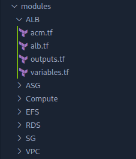

# AUTOMATE-INFRASTRUCTURE-WITH-IAC-USING-TERRAFORM-PART-3-REFACTORING-USING-MODULES
-----------------------------
### Exploring terraform modules for refactoring code

### Introducing Backend on S3

Each Terraform configuration can specify a backend, which defines where and how operations are performed, where state snapshots are stored, etc. Take a peek into what the states file looks like. It is basically where terraform stores all the state of the infrastructure in json format. So far, we have been using the default backend, which is the local backend – it requires no configuration, and the states file is stored locally. This mode can be suitable for learning purposes, but it is not a robust solution, so it is better to store it in some more reliable and durable storage.

Another useful option that is supported by S3 backend is State Locking – it is used to lock your state for all operations that could write state. This prevents others from acquiring the lock and potentially corrupting your state. State Locking feature for S3 backend is optional and requires another AWS service – DynamoDB.

* Add S3 and DynamoDB resource blocks before deleting the local state file.

* Update terraform block to introduce backend and locking.

* Re-initialize terraform

* Delete the local tfstate file and check the one in S3 bucket.

* Add outputs.

* terraform apply

* Create a file and name it backend.tf. Add the below code and replace the name of the S3 bucket you created in [Project-16](https://github.com/lateef-taiwo/AUTOMATE-INFRASTRUCTURE-WITH-IAC-USING-TERRAFORM-PART-1).

        resource "aws_s3_bucket" "terraform_state" {
        bucket = "savvy-dev-terraform-bucket"
        # Enable versioning so we can see the full revision history of our state files
        versioning {
            enabled = true
        }
        # Enable server-side encryption by default
        server_side_encryption_configuration {
            rule {
            apply_server_side_encryption_by_default {
                sse_algorithm = "AES256"
            }
            }
        }
        }

You must be aware that Terraform stores secret data inside the state files. Passwords, and secret keys processed by resources are always stored in there. Hence, you must consider to always enable encryption. You can see how we achieved that with `server_side_encryption_configuration`.

Next, we will create a DynamoDB table to handle locks and perform consistency checks. In previous projects, locks were handled with a local file as shown in `terraform.tfstate.lock.info`. Since we now have a team mindset, causing us to configure S3 as our backend to store state file, we will do the same to handle locking. Therefore, with a cloud storage database like DynamoDB, anyone running Terraform against the same infrastructure can use a central location to control a situation where terraform is running at the same time from multiple different people.

* Dynamo DB resource for locking and consistency checking:

        resource "aws_dynamodb_table" "terraform_locks" {
        name         = "terraform-locks"
        billing_mode = "PAY_PER_REQUEST"
        hash_key     = "LockID"
        attribute {
            name = "LockID"
            type = "S"
        }
        }

Terraform expects that both S3 bucket and DynamoDB resources are already created before we configure the backend. Run terraform apply to provision resources.

* Configure S3 Backend

        terraform {
        backend "s3" {
            bucket         = "savvy-dev-terraform-bucket"
            key            = "global/s3/terraform.tfstate"
            region         = "us-east-1"
            dynamodb_table = "terraform-locks"
            encrypt        = true
        }
        }

Re-initialize the backend. Run terraform init and confirm you are happy to change the backend by typing yes.

* Verify the changes

* Open the AWS console now to see what happened you should be able to see the following:

    * tfstatefile is now inside the S3 bucket.

    
    
    
    
    

    * DynamoDB table which we create has an entry which includes state file status
    

Add the code below to output.tf file so that the s3 bucket ARN and DynamoDB table name can be displayed.

    output "s3_bucket_arn" {
    value       = aws_s3_bucket.terraform_state.arn
    description = "The ARN of the S3 bucket"
    }
    output "dynamodb_table_name" {
    value       = aws_dynamodb_table.terraform_locks.name
    description = "The name of the DynamoDB table"
    }

### Refactor Security Groups creation with dynamic blocks

* EC2 refactoring with Map and Lookup

Amazon Machine Image (AMI) is a regional service which means it is only available in the region it was created. But what if we change the region later, and want to dynamically pick up AMI IDs based on the available AMIs in that region? This is where we will introduce Map and Lookup functions.

Map uses a key and value pairs as a data structure that can be set as a default type for variables.

FOR EXAMPLE

    variable "images" {
    type = "map"
    default = {
        us-east-1 = "image-1234"
        us-west-2 = "image-23834"
       }
    }

To select an appropriate AMI per region, we will use a lookup function which has following syntax: lookup(map, key, [default]).

Note: A default value is better to be used to avoid failure whenever the map data has no key.

FOR EXAMPLE

    resource "aws_instace" "web" {
    ami  = "${lookup(var.images, var.region), "ami-12323"}
    }

### Conditional Expressions

If you want to make some decision and choose some resource based on a condition – you shall use Terraform Conditional Expressions. In general, the syntax is as following: condition ? true_val : false_val

FOR EXAMPLE

        resource "aws_db_instance" "read_replica" {
    count               = var.create_read_replica == true ? 1 : 0
    replicate_source_db = aws_db_instance.this.id
    }

### REFACTORING USING MODULES

    Create new directories and move the respective files into them.

Notice there is a variable.tf file in all my directories. Go ahead and create them too.

* Create a new main.tf and provider.tf file in the root directory.

* Cut this section of code from /modules/VPC/main.tf and paste it in the provider.tf file.

provider "aws" {
  region = var.region
}

* Modify the modules and declare all the respective variables in their variables.tf file.

* You can further split the codes into smaller partitions just for clarity.

* In the provider.tf file, paste the code below into it

        terraform {
        required_providers {
            aws = {
            source = "hashicorp/aws"
            version = "~> 4.0"
            }
        }
        }

        provider "aws" {
        region = var.region
        }

* Now run terraform validate to validate the configuration. If satisfied, run terraform plan and terraform apply, to create the infrastructure.

    `tf validate`

    

    `tf plan`

    

    `tf apply`

    

    

    

    

    

    

    

    

    

    

    

    

    

    

### Congratulations !!!
You have done a great job developing and refactoring AWS Infrastructure as Code with Terraform!
