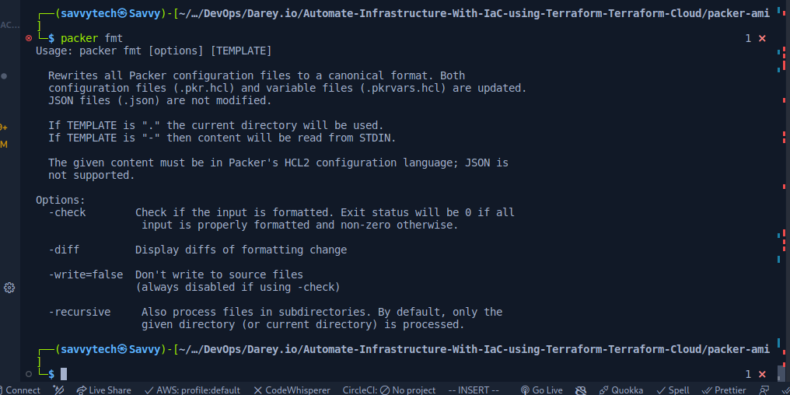
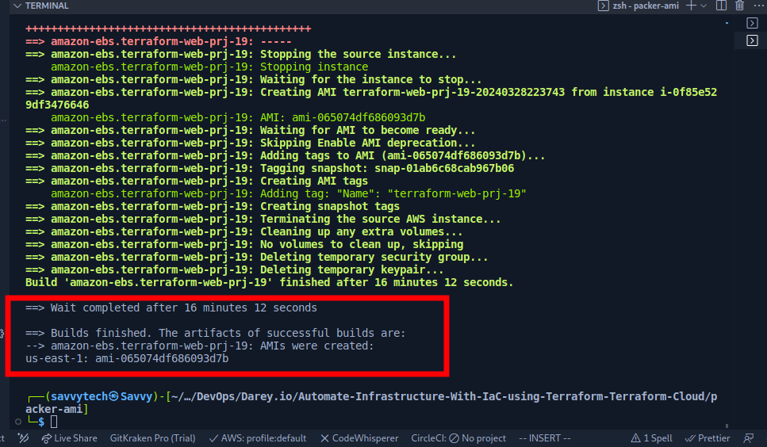
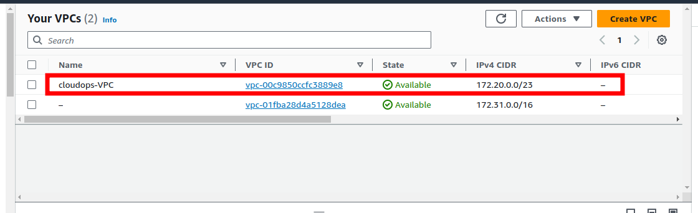
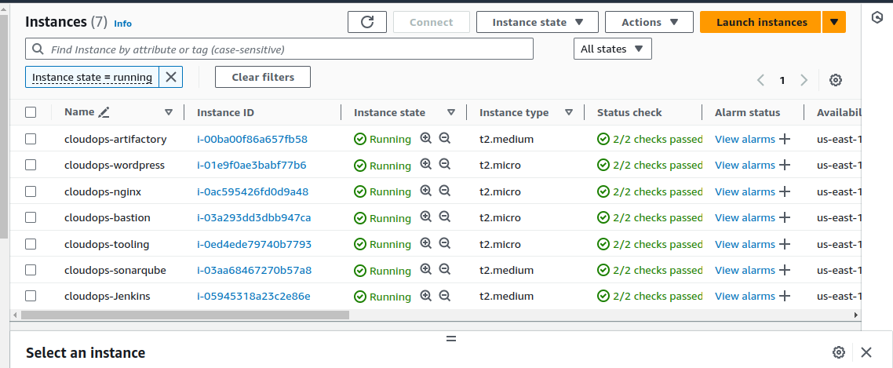

# Automate-Infrastructure-With-IaC-using-Terraform-Terraform-Cloud
In project 18 , we refactored our terraform codes into modules and as a result the introduction of modules into our codebase helped save time and reduce costly errors by re-using configuration written either by yourself, other members of your team, or other Terraform practitioners who have published modules for you to use.

We require AMIs that are pre-configured with necessary packages for our applications to run on specific servers.

In this project we will be using Packer to build our images, and Ansible to configure the Infrastructure.
In this project, we will be introducing two new concepts

* Packer
* Terraform Cloud

#### Migrate your .tf codes to Terraform Cloud
Let us explore how we can migrate our codes to Terraform Cloud and manage our AWS infrastructure from there:

1. Create a Terraform Cloud account

Follow this [link](https://app.terraform.io/signup/account), create a new account, verify your email and you are ready to start

Most of the features are free, but if you want to explore the difference between free and paid plans – you can check it on [this page](https://www.hashicorp.com/products/terraform/pricing).

2. Create an organization

 Select "Start from scratch", choose a name for your organization and create it.

  

3. Configure a workspace

Understand the difference between version control workflow, CLI-driven workflow and API-driven workflow and other configurations that we are going to implement. We will use version control workflow as the most common and recommended way to run Terraform commands triggered from our git repository. Create a new repository in your GitHub and call it terraform-cloud, push your Terraform codes developed in the previous projects to the repository. Choose version control workflow and you will be prompted to connect your GitHub account to your workspace – follow the prompt and add your newly created repository to the workspace.

Move on to "Configure settings", provide a description for your workspace and leave all the rest settings default, click "Create workspace".

4. Configure variables 

Terraform Cloud supports two types of variables: environment variables and Terraform variables. Either type can be marked as sensitive, which prevents them from being displayed in the Terraform Cloud web UI and makes them write-only. 

Set two environment variables: `AWS_ACCESS_KEY_ID` and `AWS_SECRET_ACCESS_KEY`, set the values that you used in [Project 16](https://github.com/lateef-taiwo/AUTOMATE-INFRASTRUCTURE-WITH-IAC-USING-TERRAFORM-PART-1). These credentials will be used to provision your AWS infrastructure by Terraform Cloud. After you have set these 2 environment variables – your Terraform Cloud is all set to apply the codes from GitHub and create all necessary AWS resources.

  

5. Now it is time to run our Terraform scripts, but in our previous project which was [project 18](https://github.com/lateef-taiwo/AUTOMATE-INFRASTRUCTURE-WITH-IAC-USING-TERRAFORM-PART-3-REFACTORING-USING-MODULES), we talked about using Packer to build our images, and Ansible to configure the infrastructure, so for that we are going to make few changes to our our existing repository from Project 18.

The files that would be Added is;

* AMI: for building packer images
* Ansible: for Ansible scripts to configure the infrastructure.

6. Run `terraform plan` and `terraform apply` from web console Switch to "Runs" tab and click on "Queue plan manually" button. If planning has been successful, you can proceed and confirm Apply – press "Confirm and apply", provide a comment and "Confirm plan" Check the logs and verify that everything has run correctly. Note that Terraform Cloud has generated a unique state version that you can open and see the codes applied and the changes made since the last run.

7. Test automated `terraform plan` By now, you have tried to launch plan and apply manually from Terraform Cloud web console. But since we have an integration with GitHub, the process can be triggered automatically. Try to change something in any of `.tf` files and look at "Runs" tab again – `plan` must be launched automatically, but to `apply` you still need to approve manually. Since provisioning of new Cloud resources might incur significant costs. Even though you can configure "Auto apply", it is always a good idea to verify your plan results before pushing it to `apply` to avoid any misconfigurations that can cause ‘bill shock’.

### Action Plan for this  project

 * Build images using packer

 * confirm the AMIs in the console

 * update terraform script with new ami IDs generated from packer build

 * create terraform cloud account and backend

 * run terraform script

 * update ansible script with values from teraform output
    * RDS endpoints for wordpress and tooling
    * Database name, password and username for wordpress and tooling
    * Access point ID for wordpress and tooling
    * Internal load balancer DNS for nginx reverse proxy

 * run ansible script

 * check the website

* Install packer on your machine and input data required in each AMI created.

* Run packer build for each of the files required and confirm if the AMI's were created.

### What is Packer?
---------
Packer is an open source tool for creating identical machine images for multiple platforms from a single source configuration. Packer is lightweight, runs on every major operating system, and is highly performant, creating machine images for multiple platforms in parallel.

### Step 1. Creating Bastion, Nginx, Tooling and Wordpress AMIs

We write packer code which helps us create AMIs for each of the following mentioned servers. A sample of the code can be found here: [packer code setup](https://github.com/lateef-taiwo/Automate-Infrastructure-With-IaC-using-Terraform-Terraform-Cloud/tree/main/packer-ami)

For each of the following `.pkr.hcl` files, we run the following commands

    - packer fmt <name>.pkr.hcl
    - packer validate <name>.pkr.hcl
    - packer build <name>.pkr.hcl

Before you proceed ensure you have the following tools installed on your local machine;

* packer
  

  

  

  

  

  * Ensure Packer plugin is installed
    `packer plugins install github.com/hashicorp/amazon`
    

* Ansible

Refer to this [repository](https://github.com/darey-devops/PBL-project-19.git) for guidance on how to refactor your environment to meet the new changes above and ensure you go through the README.md file.

### for bastion

`packer fmt bastion.pkr.hcl`

`packer validate bastion.pkr.hcl`

`packer build bastion.pkr.hcl`
 

 

 

 

 #### for nginx

`packer fmt nginx.pkr.hcl`

 `packer validate nginx.pkr.hcl`

 `packer build nginx.pkr.hcl`
 

 

 

 

 #### for ubuntu

 `packer fmt ubuntu.pkr.hcl`

 `packer validate ubuntu.pkr.hcl`

  `packer build ubuntu.pkr.hcl`
 
 
 
 

#### for web

 `packer fmt ubuntu.pkr.hcl`

 `packer validate ubuntu.pkr.hcl`

 `packer build ubuntu.pkr.hcl`
 
 
 
 
 

Update the new AMI's ID from the packer build in the terraform script

### Step 2. Setting Up Infrastructures using Terraform Cloud
-------------

In this project, we changed the backend from S3 to a remote backend using Terraform Cloud. TF Cloud manages all state in our applications and carries out tf plan , tf validate and applies our infrastructures as required.

To do this, we setup an organization on terraform cloud and a workspace and link our workspace to our repository. On every commit, a webhook is triggered on terraform cloud and plans or applies our terrraform code based on need.

`terraform plan on terraform cloud ui`
 
 
 

`terraform apply on terraform cloud ui`
 
 
 
 
 

  #### Resources created on AWS Cloud
  `VPC`
  

  `Subnets`
  

  `EC2 instances` 
  

  `EFS`
  

 `Access points`
  

  `Route53`
  

  `acm`
  

  `RDS Database`
  

  `Security Groups`
  

  `Route Tables`
  

  `Internet Gateway`
  
  
  `Nat Gateway`
  

