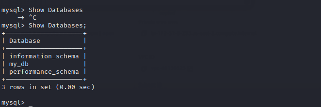

# IMPLEMENT A CLIENT SERVER ARCHITECTURE ON AWS USING MYSQL DATABASE MANAGEMENT SYSTEM (DBMS).
This Repository explains the step involved in setting up client-server architecture with Mysql on AWS.

Client-Server refers to an architecture in which two or more computers are connected together over a network to send and receive requests between one another.
In their communication, each machine has its own role: the machine sending requests is usually referred as "Client" and the machine responding (serving) is called "Server".

A simple diagram of Web Client-Server architecture is presented below:

----------
__________

### Create and configure two Linux-based virtual servers (EC2 instances in AWS).
Name the first server "mysql server" and the second server "mysql client"

### First create the first Linux server (mysql server)
<!-- UL -->
* Login to the AWS console
* Search for EC2 (Elastic Compute Cloud) 
* Select your preferred region (the closest to you) and launch a new EC2 instance of t2.micro family with Ubuntu Server 20.04 LTS (HVM)
* Type `mysql server` as the name of the server
 Click create a new key pair, use any name of your choice as the name for the pem file and select `.pem`.
    * Linux/Mac users, choose .pem for use with openssh. This allows you to connect to your server using open ssh clients.
    * For windows users choose .ppk for use with putty. Putty is a software that lets you connect remotely to servers
* Save your private key (.pem file) securely and do not share it with anyone! If you lose it, you will not be able to connect to your server ever again! 

* Now, the the first server named "mysql server" has been created.

    

* On your local computer, open the terminal and change directory to the Downloads folder, type 
    > `cd ~/Downloads `
* Change permissions for the private key file (.pem), otherwise you will get an error “Bad permission”
    > `sudo chmod 0600 <private-key-name>. pem `

    

* Connect to the instance by running
    > `ssh -i <private-key-name>. pem ubuntu@<Public-IP-address>`

    
    
* Now install install MySQL Server software on mysql server Linux server.

     It is good practice to first update and upgrade the Linux server before installing any software on it. 

    `sudo apt update`

    

    `sudo apt upgrade`

    

    Install mysql server software

    `sudo apt install mysql-server`

    

* Now, You need to configure mysql server to allow connections from remote hosts. Using your favourite text editor, edit mysql config file located at `/etc/mysql/mysql.conf.d/mysqld.cnf`

    `sudo vi /etc/mysql/mysql.conf.d/mysqld.cnf`

    

* Change the line ‘bind address 127.0.0.1’ to ‘bind address 0.0.0.0’ 

    

* Now restart mysql service and check the status to ensure its running

    `sudo systemctl restart mysql`

    `sudo systemctl status` mysql

    

* Log in to the MySQL console by typing:

    > `$ sudo mysql`

    

* Create database.

  `CREATE DATABASE example_database;`

  

* Check the databases on the server, type:

  `Show Databases;`

  

    
------------
____________

 ### Now create the second Linux server (mysql client)
<!-- UL -->
* Login to the AWS console
* Search for EC2 (Elastic Compute Cloud) 
* Select your preferred region (the closest to you) and launch a new EC2 instance of t2.micro family with Ubuntu Server 20.04 LTS (HVM)
* Type `mysql client` as the name
 Click create a new key pair, use any name of your choice as the name for the pem file and select `.pem`.
    * Linux/Mac users, choose .pem for use with openssh. This allows you to connect to your server using open ssh clients.
    * For windows users choose .ppk for use with putty. Putty is a software that lets you connect remotely to servers
* Save your private key (.pem file) securely and do not share it with anyone! If you lose it, you will not be able to connect to your server ever again! 

* Now, the the second Linux server named "mysql client" has been created.

    

* On your local computer, open the terminal and change directory to the Downloads folder, type 
    > `cd ~/Downloads `
* Change permissions for the private key file (.pem), otherwise you will get an error “Bad permission”
    > `sudo chmod 0600 <private-key-name>. pem `

    

* Connect to the instance by running
    > `ssh -i <private-key-name>. pem ubuntu@<Public-IP-address>`

    
    
* Now install install MySQL Server software on mysql server Linux server.

     It is good practice to first update and upgrade the Linux server before installing any software on it. 

    `sudo apt update`

    

    `sudo apt upgrade`

    

    Install mysql client software

    `sudo apt install mysql-client` 

    

### Now create a database and a database user to test your client-server architecture setup.

* On mysql-server Linux server, log in to the mysql console.

    `sudo mysql -u root -p`

    

* Create a database user as in the command below, you choose any name and password of your choice.

    `mysql> CREATE USER 'example_user'@'%' IDENTIFIED WITH mysql_native_password BY 'password';`

    
    
* Now grant the user access to the database

    > `mysql> CREATE DATABASE example_database;`

    > `GRANT ALL ON example_database.* TO 'savvy'@'%' WITH GRANT OPTION;`

    

* On the client, connect to the server using database user you just created

    `sudo mysql -u <username> -h <server ip address> -p`

    

* check the databses on the server using the command `Show Databases;`
    
    If you see an output similar to the one below, then you have successfully implemented the client-server architecture.

    

-----
### CONGRATULATIONS!!!
