# Devops-Tooling-Website-Solution
This repostory explains the steps involved in building and deploying a 3-Tier Web application with a single Database and an NFS server as a shared file storage.

----------
__________
### STEP 1 - PREPARE NFS SERVER
* Spin up a new EC2 instance with RHEL Linux 8 Operating System. Search for 
 RHEL-8.2.0_HVM-20210907-x86_64-0-Hourly2-GP2 in the AWS Marketplace AMIs or Community AMIs. Name it `nfs server`

* Based on your LVM experience from [Wordpress solution using 3 Tier Architecture Project](https://github.com/lateef-taiwo/Deploy-Web-Solution-with-Wordpress-on-AWS), Configure LVM on the Server.

* Instead of formatting the disks as ext4, you will have to format them as xfs.

* Ensure there are 3 Logical Volumes. lv-opt lv-apps, and lv-logs.

* Create 3 volumes in the same AZ as your Web Server EC2, each of 10 GiB.

    1.  On the left hand side of the aws console, under Elastic Blob Store, Click on `Volume`.

    2.  Click create volume

    3.  Choose a small size of 10GB

    4. change the availability zone to eu-west-2b 
    
    5.  Leave other settings default and click `Create volume`

    6.  Next, select the volume created, right click and click `Attach volume`.

    7.  Select the web server instance created. I named my server `web server`. The device name will be `/dev/sdf` but newer Linux kernels may rename your devices to `/dev/xvdf` through /dev/xvdp internally, even when the device name entered is `/dev/sdf`
    
    8.  Click Attach volume 

    

    9.  Repeat steps `2` to `8` for two more volumes so that we can have 3 volumes.

    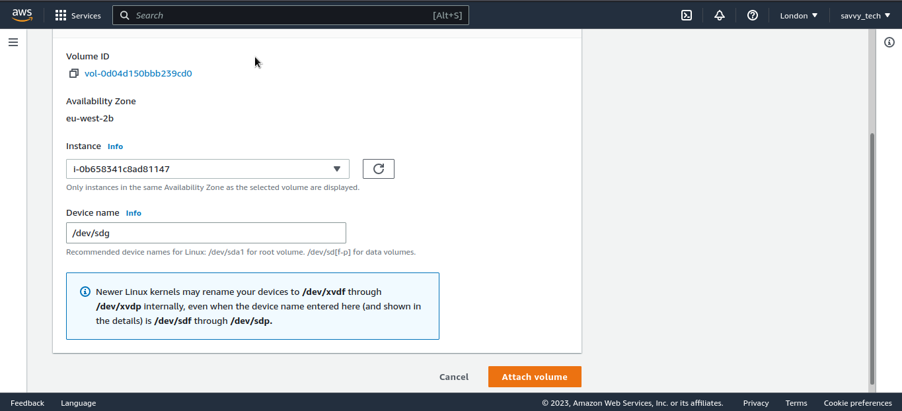

    

* Create mount points on /mnt directory for the logical volumes as follow.
* On your local computer, open the terminal and change directory to the Downloads folder, type

    `cd ~/Downloads`

* Change permissions for the private key file (.pem), otherwise you will get an error “Bad permission”

    `sudo chmod 0400 . pem`

* Connect to the instance by running

   `ssh -i web-server.pem ec2-user@<public ip address>`

   

    Note: For Red hat, the usernanme is ec2-user while for Ubuntu the username is ubuntu.

 * check the volumes created by typing `lsblk`. You will see that the 3 volumes are "xvdf" "xvdg" and "xvdh" of size 10GB each respectively as shown below.

    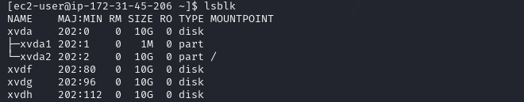

 * Use `df -h` command to see all mounts and free space on your server. `df` means disk free and the flag `-h` displays the output in a human readable format.

    

* Use `gdisk` utility to create a single partition on each of the 3 disks. First start with disk xvdf.

    `sudo gdisk /dev/xvdf`

    * Type p to view the partion table. 

    * Type n to add a new partition. Press enter repeatedly to use the default values

    * Type w to write partition changes to disk. T ype Y on prompt

    

    * Repeat the process for the remaining two disks

    

    

* Use `lsblk` utility to view the newly configured partition on each of the 3 disks.

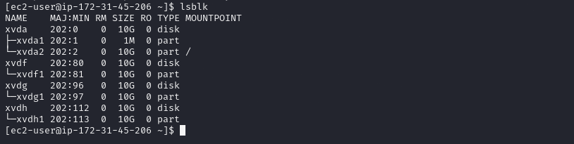

* Install `lvm2` package using `sudo yum install -y lvm2 `

 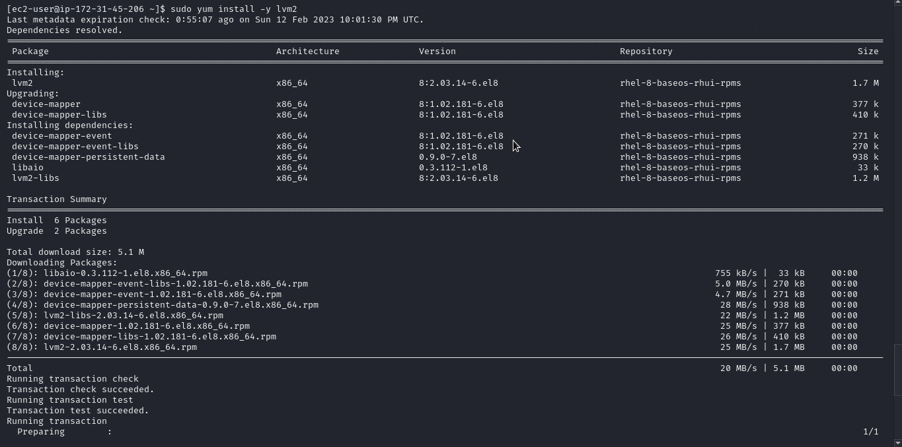

  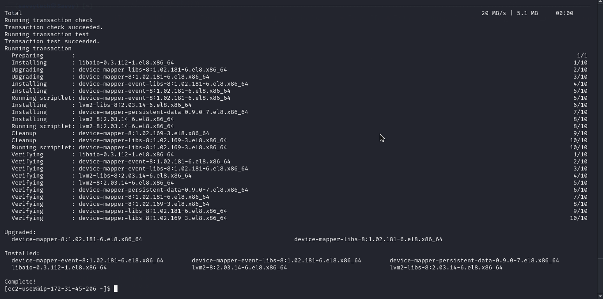

* Type `sudo lvmdiskscan` command to check for available partitions.

 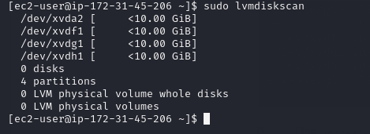
 * Use `pvcreate` utility to mark each of 3 disks as physical volumes (PVs) to be used by LVM
 
    `sudo pvcreate /dev/xvdf1`

    `sudo pvcreate /dev/xvdg1`

    `sudo pvcreate /dev/xvdh1`

* Verify that your Physical volume has been created successfully by running `sudo pvs`

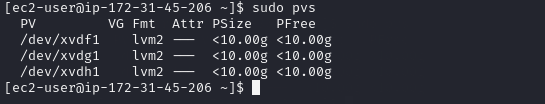

* Use `vgcreate` utility to add all 3 PVs to a volume group (VG). Name the VG webdata-vg. Type

`sudo vgcreate webdata-vg /dev/xvdh1 /dev/xvdg1 /dev/xvdf1`

* Verify that your VG has been created successfully by running `sudo vgs`

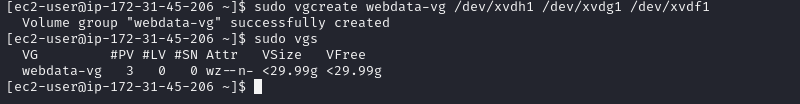

* Use `lvcreate` utility to create 2 logical volumes. Name one apps-lv and use half of the PV size. Name the second one logs-lv and use the remaining space of the PV size. NOTE: apps-lv will be used to store data for the Website while, logs-lv will be used to store data for logs.

    `sudo lvcreate -n apps-lv -L 9.9G webdata-vg`

    `sudo lvcreate -n logs-lv -L 9.9G webdata-vg`

    `sudo lvcreate -n opt-lv -L 9.9G webdata-vg`

   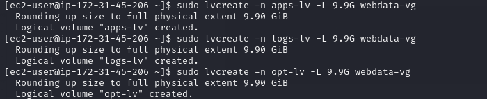

* Verify that your Logical Volume has been created successfully by typing `sudo lvs`

   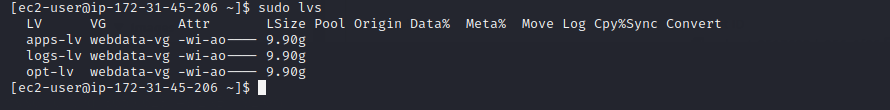

* Verify the entire setup by typing the following commands

    `sudo vgdisplay -v #view complete setup - VG, PV, and LV`

   `sudo lsblk`

   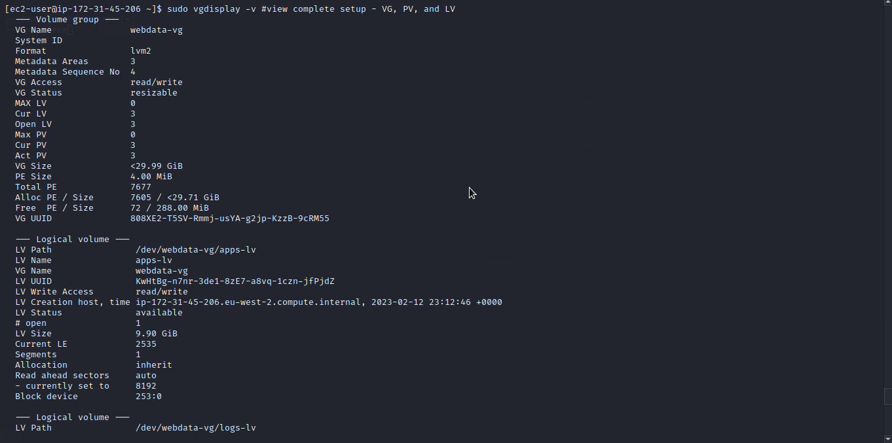

   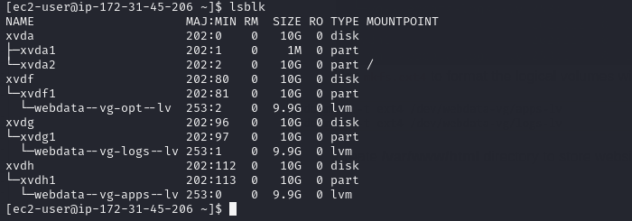

* Use `mkfs.xfs` to format the logical volumes with ext4 filesystem

    `sudo mkfs -t xfs /dev/webdata-vg/apps-lv`

    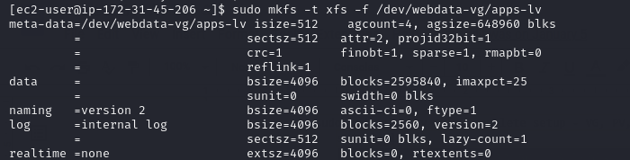

    `sudo mkfs -t xfs /dev/webdata-vg/logs-lv`

    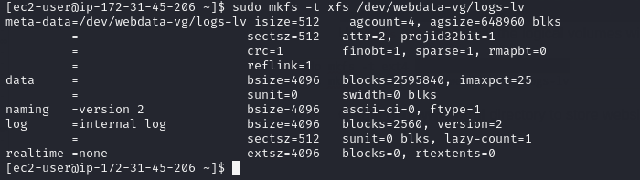

    `sudo mkfs -t xfs -f /dev/webdata-vg/opt-lv`

    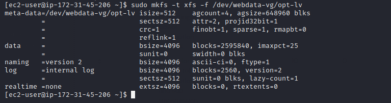

* Type `lsblk -f` to view partitions including the file system.
 
    

 * Create /mnt/apps directory to store website files

    `sudo mkdir -p /mnt/apps`

* Create /mnt/logs to store backup of log data
 
    `sudo mkdir -p /mnt/logs`

* Create /mnt/opt to be used by jenkins server in the next project.
 
    `sudo mkdir -p /mnt/opt`

* Mount lv-apps on /mnt/apps – To be used by webservers.

   `sudo mount /dev/webdata-vg/apps-lv /mnt/apps`
 
   * Use `rsync` utility to back up all the files in the log directory /var/log into /mnt/logs (This is required before mounting the file system). Type

     `sudo rsync -av /var/log/. /mnt/logs/`

     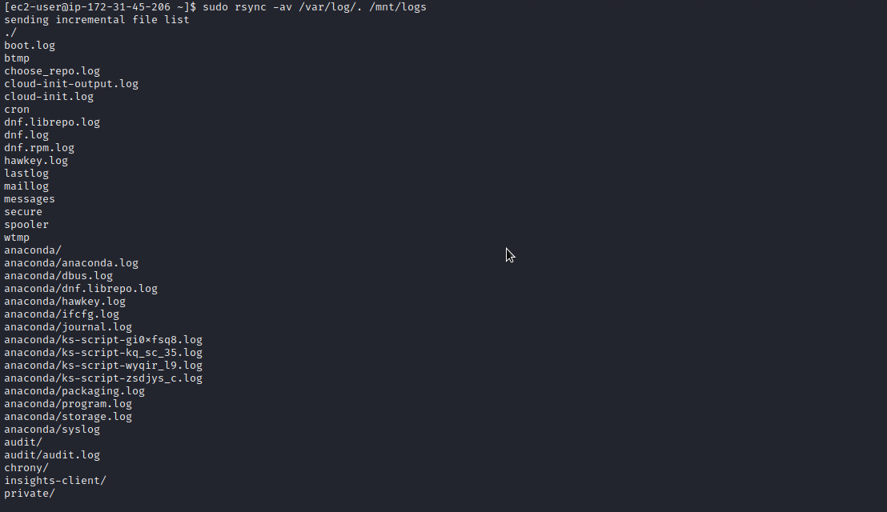

* Mount /var/log on logs-lv logical volume. – To be used by webserver logs.  (Note that all the existing data on /var/log will be deleted. This is why the last step above is very
important)

   `sudo mount /dev/webdata-vg/logs-lv /mnt/logs`

   * Restore log files back into /var/log directory

   `sudo rsync -av /mnt/logs. /var/log`

   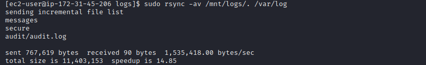

* Mount lv-opt on /mnt/opt – To be used by Jenkins server in one of our projects.
  
    `sudo mount /dev/webdata-vg/opt-lv /mnt/opt`

  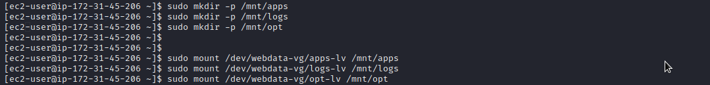

* Update `/etc/fstab` file so that the mount configuration will persist after restart of the server. The UUID of the device will be used to update the /etc/fstab file;

  `sudo blkid`

  

* Now type `sudo vi /etc/fstab`

  

* Update /etc/fstab in this format using your own UUID as shown below.

  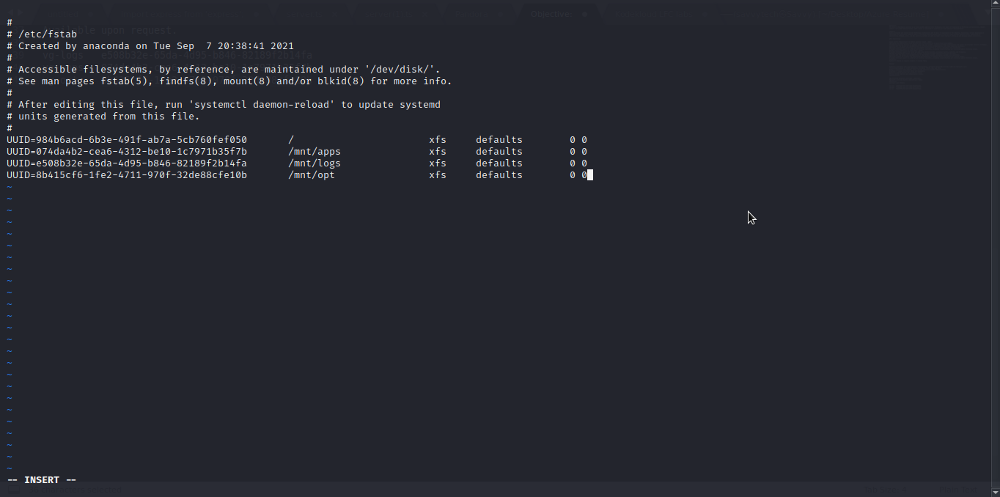

* Test the configuration and reload the daemon
 
   `sudo mount -a`
   `sudo systemctl daemon-reload`

   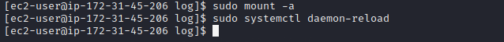
 
* Verify your setup by running `df -h`, output must look like the one in the image below:

  

* Install NFS server, configure it to start on reboot and make sure it is u and running

      sudo yum -y update
      sudo yum install nfs-utils -y
      sudo systemctl start nfs-server.service
      sudo systemctl enable nfs-server.service
      sudo systemctl status nfs-server.service

  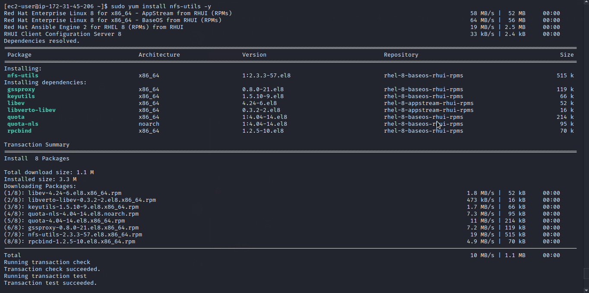
  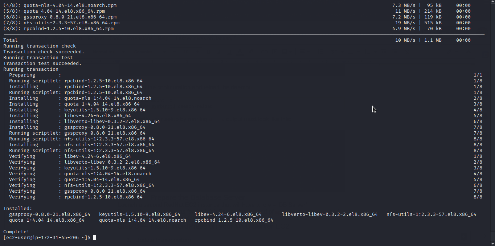
  

* check your subnet cidr – open your EC2 details in the AWS web console and locate the ‘Networking’ tab and open a Subnet link:

 
 

* Ensure you set up permission that will allow Web servers to read, write and execute files on NFS:

      sudo chown -R nobody: /mnt/apps
      sudo chown -R nobody: /mnt/logs
      sudo chown -R nobody: /mnt/opt
        
      sudo chmod -R 777 /mnt/apps
      sudo chmod -R 777 /mnt/logs
      sudo chmod -R 777 /mnt/opt
        
      sudo systemctl restart nfs-server.service

  

* Export the mounts for webservers `subnet CIDR` to connect as clients.

  `sudo vi /etc/exports`

  

  `sudo exportfs -arv`

  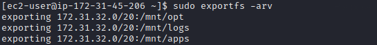

* Check which port is used by NFS and open it using Security Groups (add new Inbound Rule)

  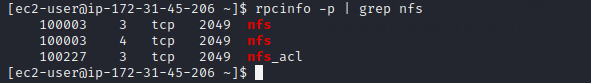

*  In order for NFS server to be accessible from your client, you must also open following ports: TCP 111, UDP 111, UDP 2049

  
 
------
________

### STEP 2 - CONFIGURE THE DATABASE SERVER
* Spin up a new EC2 instance with RHEL Linux 8 Operating System. Name it database server.

  

* Install MySQL server

   `sudo yum install mysql-server`

   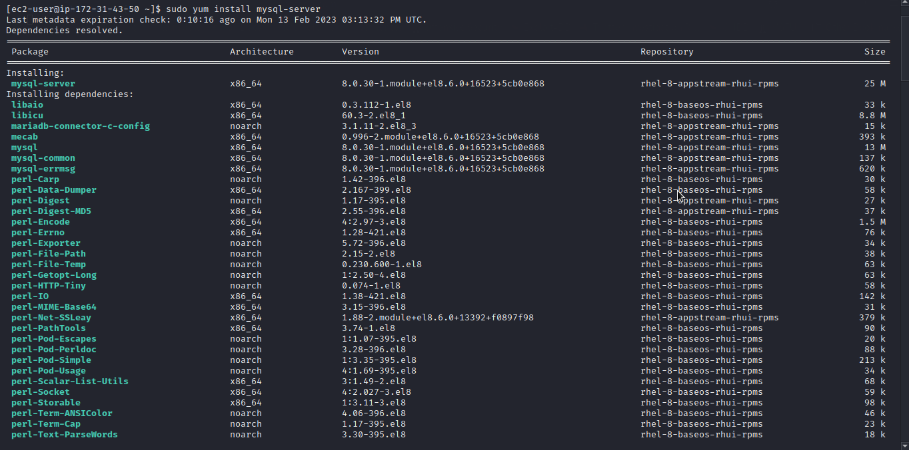
    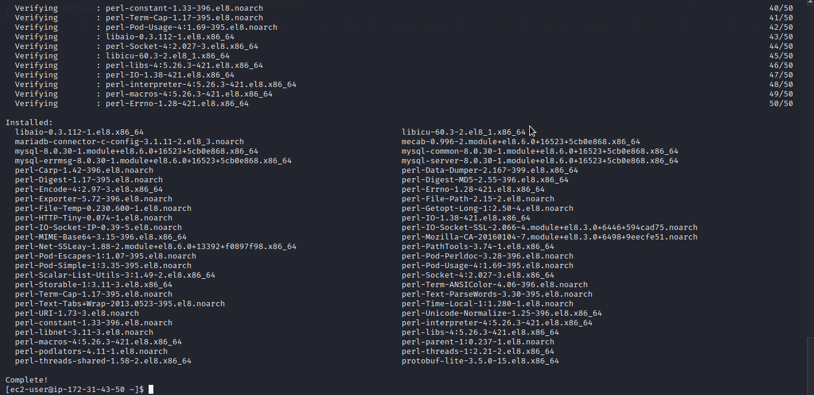

* Verify that the service is up and running by using `sudo systemctl status mysqld`, if it is not running, restart the service and enable it so it will be running even after reboot:

  `sudo systemctl restart mysqld`

  `sudo systemctl enable mysqld`

* Check the status of mysql service again.

  `sudo systemctl status mysqld`  

  

* Create a database and name it tooling

* Create a database user and name it webaccess

* Grant permission to webaccess user on tooling database to do anything only from the webservers subnet cidr.

 

 --------
 ________

 ### STEP 3 - PREPARE WEB SERVERS
During the next steps we will do following:
* Configure NFS client (this step must be done on all three servers)
* Deploy a Tooling application to our Web Servers into a shared NFS folder
* Configure the Web Servers to work with a single MySQL database
  1. Launch a new EC2 instance with RHEL 8 Operating System
  2. Install NFS client
  
     `sudo yum install nfs-utils nfs4-acl-tools -y`

   

   

  3. Mount /var/www/ and target the NFS server’s export for apps

     `sudo mkdir /var/www`

     `sudo mount -t nfs -o rw,nosuid <NFS-Server-Private-IP-Address>:/mnt/apps /var/www`

  4. Verify that NFS was mounted successfully by running `df -h`.

     

  5.  Make sure that the changes will persist on Web Server after reboot:

      `sudo vi /etc/fstab`

    

  6. Install Remi’s repository, Apache and PHP

      sudo yum install httpd -y
 
      sudo dnf install https://dl.fedoraproject.org/pub/epel/epel-release-latest-8.noarch.rpm
      
      sudo dnf install dnf-utils http://rpms.remirepo.net/enterprise/remi-release-8.rpm
      
      sudo dnf module reset php
      
      sudo dnf module enable php:remi-7.4
      
      sudo dnf install php php-opcache php-gd php-curl php-mysqlnd
      
      sudo systemctl start php-fpm
      
      sudo systemctl enable php-fpm
      
      setsebool -P httpd_execmem 1

  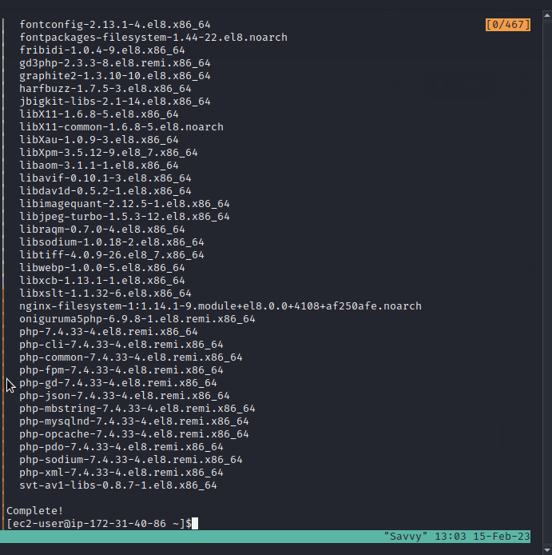

  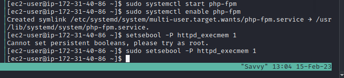

* Repeat steps 1-6 for another 2 Web Servers.

  

  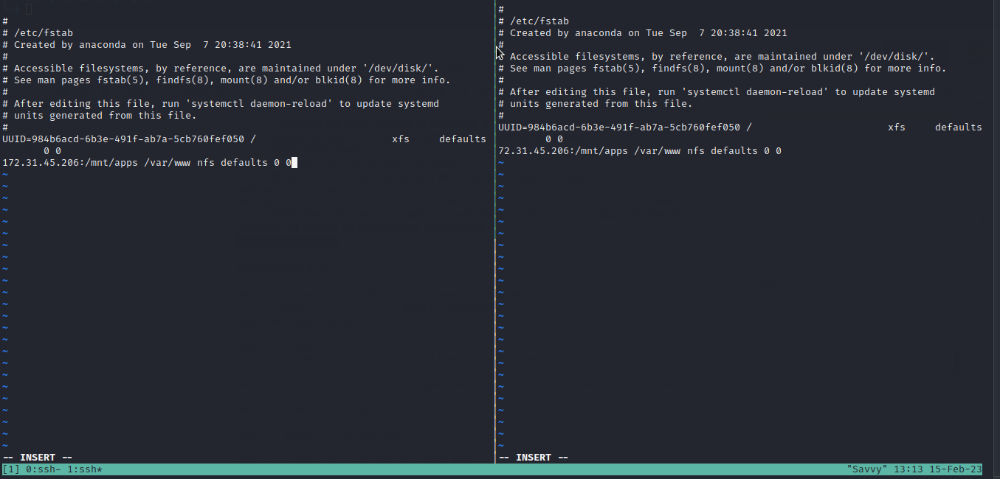

  

  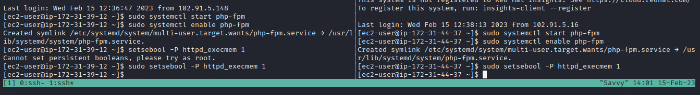

* Verify that Apache files and directories are available on the Web Server in /var/www and also on the NFS server in /mnt/apps. If you see the same files – it means NFS is mounted correctly. You can try to create a new file `touch test.md` from.

   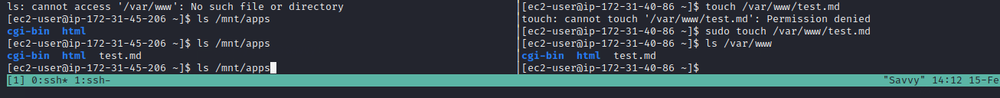

   

* Locate the log folder for Apache on the Web Server and mount it to NFS server’s export for logs. Repeat step 5 above to make sure the mount point will persist after reboot.

  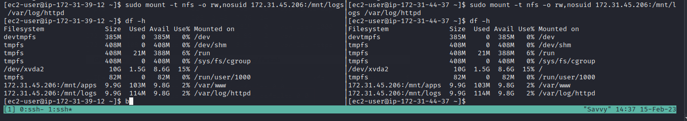

  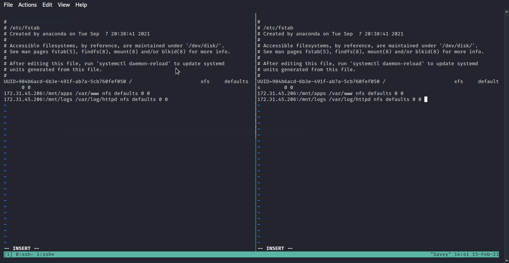

* Fork the tooling source code from [this repo](https://github.com/lateef-taiwo/DevOpsToolingWebsite) to your Github account.

* Deploy the tooling website’s code to the Webserver. Ensure that the html folder from the repository is deployed to /var/www/html

    

    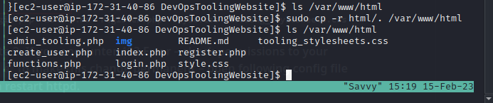

* Note 1: Do not forget to open TCP port 80 on the Web Server. 

* Note 2: If you encounter 403 Error – check permissions to your /var/www/html folder and also disable SELinux `sudo setenforce 0` To make this change permanent – open following config file `sudo vi /etc/sysconfig/selinux` and set SELINUX=disabled then restart httpd by typing `sudo systemctl restart httpd`.

   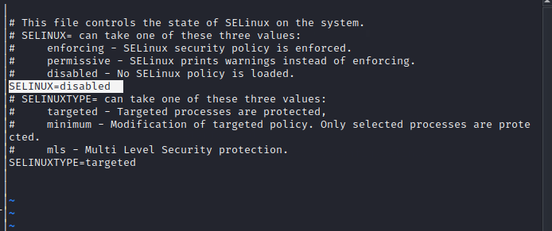

* Update the website’s configuration to connect to the database (in /var/www/html/functions.php file). `sudo vi /var/www/html/functions.php`

   

* Install mysql-client `sudo yum install mysql`

*  Apply tooling-db.sql script to your database using this command mysql -h <databse-private-ip> -u <db-username> -p <db-pasword> < tooling-db.sql

   

* Confirm if this worked in the DB-Server

   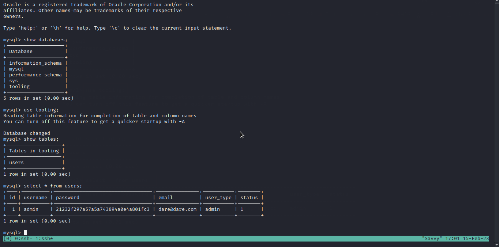

* Create in MySQL a new admin user with username: myuser and password: password:
INSERT INTO ‘users’ (‘id’, ‘username’, ‘password’, ’email’, ‘user_type’, ‘status’) VALUES
-> (1, ‘myuser’, ‘5f4dcc3b5aa765d61d8327deb882cf99’, ‘user@mail.com’, ‘admin’, ‘1’);

  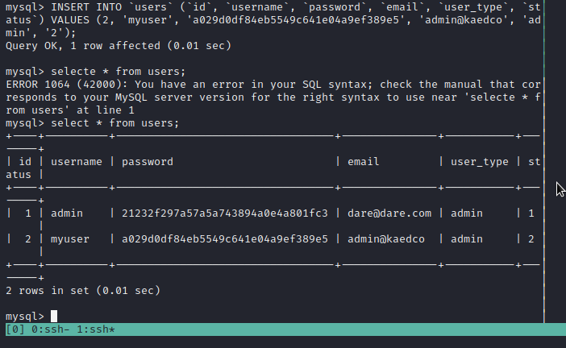

* Open the website in your browser `http://<Web-Server-Public-IP-Address-or-Public-DNS-Name>/index.php` and make sure you can login into the websute with `myuser` user.

  

  

  

-------------
_____________

### Congratulations! You have just implemented a web solution for a DevOps team using LAMP stack with remote Database and NFS servers.

