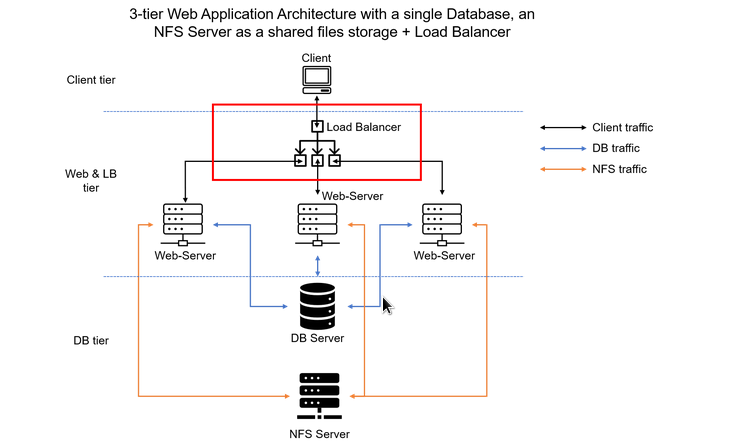
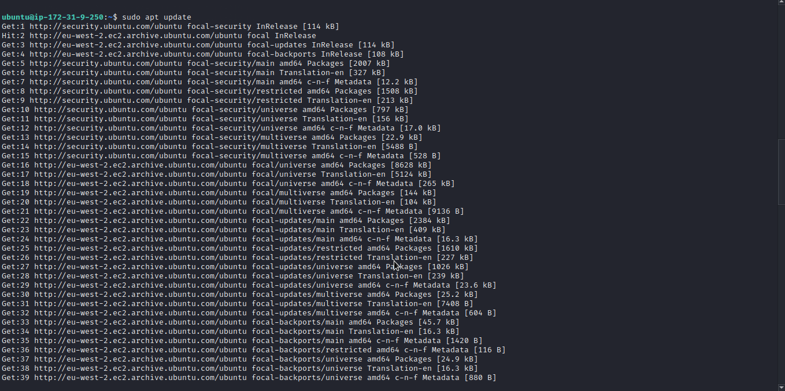
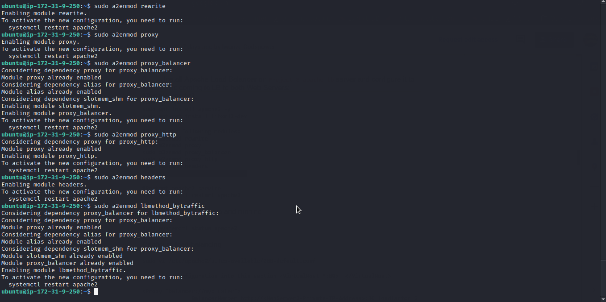
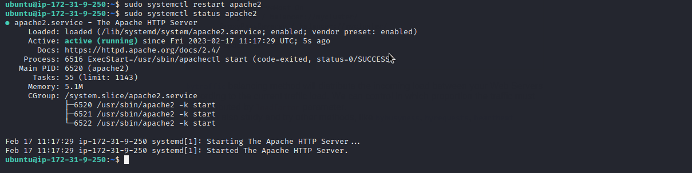
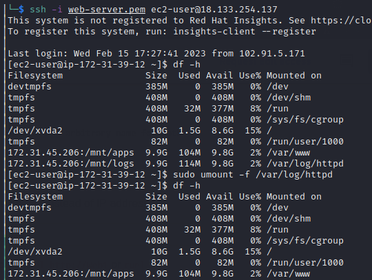
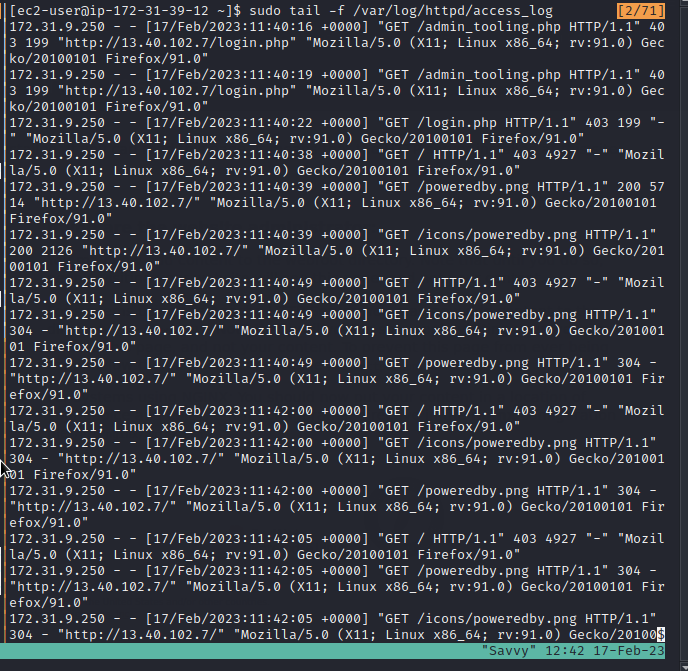
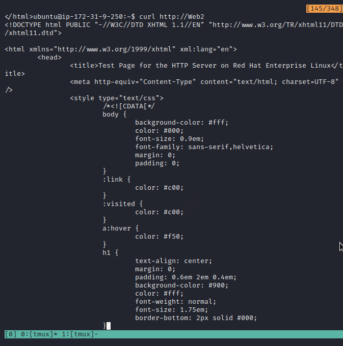
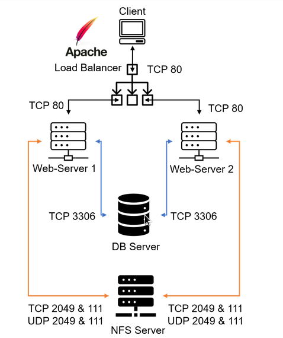

# LOAD-BALANCER-SOLUTION-WITH-APACHE
A Load Balancer (LB) distributes clients’ requests among underlying Web Servers and makes sure that the load is distributed in an optimal way. This repository demonstrates the implementation of a load balancer using apache.

After completing [Devops tooling website project](https://github.com/lateef-taiwo/Devops-Tooling-Website-Solution) you might wonder how a user will be accessing each of the webservers using 3 different IP addresses or 3 different DNS names. You might also wonder what is the point of having 3 different servers doing exactly the same thing.
When we access a website in the Internet we use an URL and we do not really know how many servers are out there serving our requests, this complexity is hidden from a regular user, but in the case of websites that are being visited by millions of users per day (like Google or Reddit), it is impossible to serve all the users from a single Web Server (it is also applicable to databases, but for now we will not focus on distributed DBs).
Each URL contains a domain name part, which is translated (resolved) to the IP address of a target server that will serve requests when open a website in the Internet. Translation (resolution) of domain names is performed by DNS servers, the most commonly used one has a public IP address 8.8.8.8 and belongs to Google. You can try to query it with nslookup command:

`nslookup 8.8.8.8`

    Server:  UnKnown
    Address:  103.86.99.99

    Name:    dns.google
    Address:  8.8.8.8
When you have just one Web server and load increases – you want to serve more and more customers, you can add more CPU and RAM or completely replace the server with a more powerful one – this is called "vertical scaling". This approach has limitations – at some point, you reach the maximum capacity of CPU and RAM that can be installed into your server.
Another approach used to cater for increased traffic is "horizontal scaling" – distributing the load across multiple Web servers. This approach is much more common and can be applied almost seamlessly and almost infinitely (you can imagine how many server Google has to serve billions of search requests).
Horizontal scaling allows adapting to the current load by adding (scale out) or removing (scale in) Web servers. Adjustment of a number of servers can be done manually or automatically (for example, based on some monitored metrics like CPU and Memory load).
The property of a system (in our case it is Web tier) to be able to handle the growing load by adding resources, is called "Scalability".
In our set-up in Project-7, we had 3 Web Servers and each of them had its own public IP address and public DNS name. A client has to access them by using different URLs, which is not a nice user experience to remember the addresses/names of even 3 servers, let alone millions of Google servers.
In order to hide all this complexity and to have a single point of access with a single public IP address/name, a Load Balancer can be used.

Below is an updated solution architecture with an LB added on top of Web Servers (for simplicity let us assume it is a software L7 Application LB, for example – Apache, NGINX or HAProxy)

  

### TASK
Deploy and configure an Apache Load Balancer for Tooling Website solution on a separate Ubuntu EC2 instance. Make sure that users can be served by Web servers through the Load Balancer.
To simplify, let us implement this solution with 2 Web Servers, the approach will be the same for 3 and more Web Servers.

---------
_________
### CONFIGURE APACHE AS A LOAD BALANCER

* Create an Ubuntu Server 20.04 EC2 instance and name it apache-load-balancer.

* Open TCP port 80 on Project-8-apache-lb by creating an Inbound Rule in the Security Group.

  

* Install Apache Load Balancer on Project-8-apache-lb server and configure it to point traffic coming to LB to both Web Servers:

  `sudo apt update`

  `sudo apt install apache2 -y`

  `sudo apt-get install libxml2-dev`

  

  

  

* Enable the following modules:
   
        sudo a2enmod rewrite
        sudo a2enmod proxy
        sudo a2enmod proxy_balancer
        sudo a2enmod proxy_http
        sudo a2enmod headers
        sudo a2enmod lbmethod_bytraffic

    

* Restart apache2 service. `sudo systemctl restart apache2`

* Make sure apache2 is up and running. `sudo systemctl status apache2`

   

* Configure load balancing by traffic balancing method which will distribute the incoming load between your Web Servers according to the current traffic load. We can control in which proportion the traffic must be distributed by loadfactor parameter.
  
  `sudo vi /etc/apache2/sites-available/000-default.conf`

    Add this configuration into this section
    
    `<VirtualHost *:80>  </VirtualHost>`
       
        <Proxy "balancer://mycluster">
                BalancerMember http://<WebServer1-Private-IP-Address>:80 loadfactor=5 timeout=1
                BalancerMember http://<WebServer2-Private-IP-Address>:80 loadfactor=5 timeout=1
                ProxySet lbmethod=bytraffic
                # ProxySet lbmethod=byrequests
            </Proxy>

        ProxyPreserveHost On
        ProxyPass / balancer://mycluster/
        ProxyPassReverse / balancer://mycluster/

  

* Restart apache server. `sudo systemctl restart apache2`

* Verify that our configuration works – try to access your LB’s public IP address or Public DNS name from your browser:
    
        http://<Load-Balancer-Public-IP-Address-or-Public-DNS-Name>/index.php

   

* Note: If in [Devops tooling website project](https://github.com/lateef-taiwo/Devops-Tooling-Website-Solution) you mounted /var/log/httpd/ from your Web Servers to the NFS server – unmount them using `sudo umount -f /var/log/httpd` and make sure that each Web Server has its own log directory.

  
  

* Open two ssh sessions for both Web Servers and run the following command:

  `sudo tail -f /var/log/httpd/access_log`

  

* Try to refresh your browser page `http://<Load-Balancer-Public-IP-Address-or-Public-DNS-Name>/index.php` several times and ensure both servers receive HTTP GET requests from your LB – new records must appear in each server’s log file. The number of requests to each server will be approximately the same since we set loadfactor to the same value for both servers – it means that traffic will be distributed evenly between them.
---------
_________
###  Configure Local DNS Names Resolution
Sometimes it is tedious to remember and switch between IP addresses, especially if you have a lot of servers under your management.
What we can do, is to configure local domain name resolution. The easiest way is to use /etc/hosts file. So let us configure the IP address to domain name mapping for our LB.

* Open this file on your LB server. `sudo vi /etc/hosts`
  
* Add 2 records into this file with the Local IP address and arbitrary name for both of your Web Servers.

        <WebServer1-Private-IP-Address> Web1
        <WebServer2-Private-IP-Address> Web2

    

* Now you can update your LB config file with those names instead of IP addresses.

        BalancerMember http://Web1:80 loadfactor=5 timeout=1
        BalancerMember http://Web2:80 loadfactor=5 timeout=1

   

* You can try to curl your Web Servers from LB locally `curl http://Web1` or `curl http://Web2` – it shall work.

  

  

### Target Architecture
   Now your set-up looks like this:

   

### Congratulations!
You have just implemented a Load balancing Web Solution for your DevOps team.

