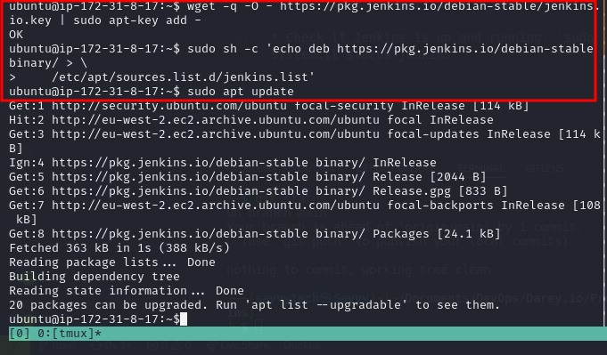

# TOOLING-WEBSITE-DEPLOYMENT-AUTOMATION-WITH-CONTINUOUS-INTEGRATION-USING-JENKINS
In this project, we are going to start automating part of our routine tasks with a free and open-source automation server – Jenkins. It is one of the most popular CI/CD tools.
According to Circle CI, Continuous integration (CI) is a software development strategy that increases the speed of development while ensuring the quality of the code that teams deploy. Developers continually commit code in small increments (at least daily, or even several times a day), which is then automatically built and tested before it is merged with the shared repository.
In our project we are going to utilize Jenkins CI capabilities to make sure that every change made to the source code in GitHub `https://github.com/<yourname>/tooling` will be automatically updated to the Tooling Website.

---------
__________

## Task
Enhance the architecture prepared in [the last project](https://github.com/lateef-taiwo/LOAD-BALANCER-SOLUTION-WITH-APACHE) by adding a Jenkins server, and configuring a job to automatically deploy source code changes from Git to the NFS server.

## Architecture Diagram
Here is what your updated architecture will look like upon completion of this project:

----------
__________

### INSTALL AND CONFIGURE JENKINS SERVER
### Step 1 – Install the Jenkins server
* Create an AWS EC2 server based on Ubuntu Server 20.04 LTS and name it "Jenkins server"

  

* Install JDK (since Jenkins is a Java-based application)

  `sudo apt update`
   
   

   `sudo apt install default-jdk-headless`

   

* Install Jenkins
  
        wget -q -O - https://pkg.jenkins.io/debian-stable/jenkins.io.key | sudo apt-key add -
        sudo sh -c 'echo deb https://pkg.jenkins.io/debian-stable binary/ > \
            /etc/apt/sources.list.d/jenkins.list'
        sudo apt update
        sudo apt-get install jenkins

   

   

* Check if Jenkins is up and running. `sudo systemctl status jenkins`
  

* By default Jenkins server uses TCP port 8080 – open it by creating a new Inbound Rule in your EC2 Security Group.

   

* Perform initial Jenkins setup.
From your browser access `http://<Jenkins-Server-Public-IP-Address-or-Public-DNS-Name>:8080`.
You will be prompted to provide a default admin password.

 
  
 

* Then you will be asked which plugings to install – choose suggested plugins.
   
   

* Once plugin installation is done – create an admin user and you will get your Jenkins server address (url), then click save and finish. The installation is completed!

--------
________

### Step 2 – Configure Jenkins to retrieve source codes from GitHub using Webhooks
Here, I will configure a simple Jenkins job/project (these two terms can be used interchangeably). This job will be triggered by GitHub webhooks and will execute a ‘build’ task to retrieve codes from GitHub and store it locally on Jenkins server.

* Enable webhooks in your GitHub repository settings.

  

  

* Go to Jenkins web console, click "New Item" and create a "Freestyle project"

  

* To connect your GitHub repository, you will need to provide its URL, you can copy it from the repository itself.

  

* In the configuration of your Jenkins freestyle project choose Git repository, and provide the link to your Tooling GitHub repository and credentials (user/password) so Jenkins could access files in the repository.

  

* Save the configuration and let us try to run the build. For now, we can only do it manually.
Click the "Build Now" button, if you have configured everything correctly, the build will be successful and you will see it under `#1`

  

* You can open the build and check in "Console Output" if it has run successfully.
  
  

* Click "Configure" your job/project and add these two configurations

   * Configure triggering the job from the GitHub webhook:
   

  * Configure "Post-build Actions" to archive all the files – files resulting from a build are called "artifacts".

   

* Now, go ahead and make some changes in any file in your GitHub repository (e.g. README.MD file) and push the changes to the master branch.

  

* You will see that a new build has been launched automatically (by webhook) and you can see its results – artifacts, saved on the Jenkins server.

  

  

* You have now configured an automated Jenkins job that receives files from GitHub by webhook trigger (this method is considered as ‘push’ because the changes are being ‘pushed’ and file transfer is initiated by GitHub). There are also other methods: trigger one job (downstream) from another (upstream), poll GitHub periodically and others.
By default, the artifacts are stored on the Jenkins server locally

   `ls /var/lib/jenkins/jobs/tooling_github/builds/<build_number>/archive/`

  
---------
_________
### CONFIGURE JENKINS TO COPY FILES TO NFS SERVER VIA SSH
Now we have our artifacts saved locally on Jenkins server, the next step is to copy them to our NFS server to /mnt/apps directory.
Jenkins is a highly extendable application and there are 1400+ plugins available. We will need a plugin that is called "Publish Over SSH".

1. Install the "Publish Over SSH" plugin. On the main dashboard select "Manage Jenkins" and choose the "Manage Plugins" menu item.
On the "Available" tab search for the "Publish Over SSH" plugin and install it.

* Configure the job/project to copy artifacts over to the NFS server.
On the main dashboard select "Manage Jenkins" and choose the "Configure System" menu item.
Scroll down to Publish over the SSH plugin configuration section and configure it to be able to connect to your NFS server:
 
   

  * Provide a private key (the content of .pem file that you use to connect to the NFS server via SSH/Putty)
  * Arbitrary name

  * Hostname – can be private IP address of your NFS server

  * Username – ec2-user (since the NFS server is based on EC2 with RHEL 8)

  * Remote directory – /mnt/apps since our Web Servers use it as a mounting point to retrieve files from the NFS server
  
    

* Test the configuration and make sure the connection returns "Success". Remember, that TCP port 22 on NFS server must be open to receive SSH connections.

    

* Save the configuration, open your Jenkins job/project configuration page and add another one "Post-build Action"

  

* Configure it to send all files produced by the build into our previously define remote directory. In our case we want to copy all files and directories – so we use `**`.

* Save this configuration and go ahead, and change something in README.MD file in your GitHub Tooling repository.

  

* Webhook will trigger a new job and in the "Console Output" of the job you will find something like this:

  

  

* To make sure that the files in /mnt/apps have been updated – connect via SSH/Putty to your NFS server and check README.MD file.  `cat /mnt/apps/README.md`. If you see the changes you had previously made in your GitHub – the job works as expected.

  

________
### Congratulations!
### You have just implemented your first Continous Integration solution using Jenkins CI.

